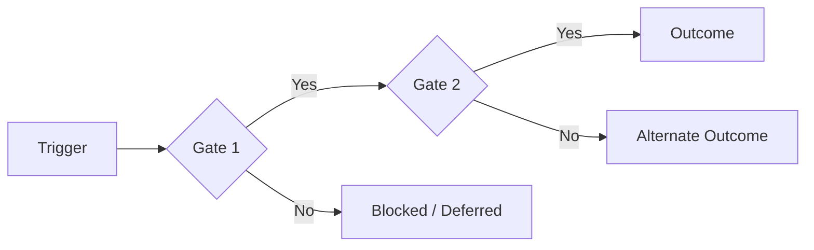
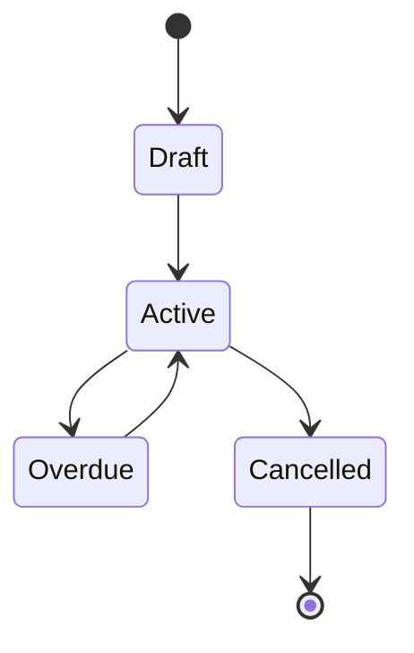
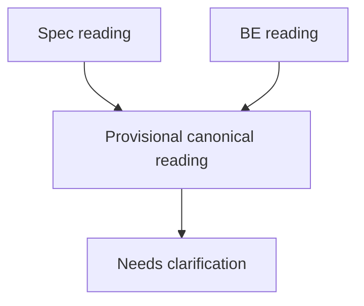

# Mermaid Patterns

Use Mermaid only when it improves review speed.

## Pattern 1 — Core Business Flow

Use for features with multiple gates or branches.

## Pattern 2 — Lifecycle Summary

Use when states drive feature behavior.

## Pattern 3 — Conflict Summary

Use only when one conflict dominates the review.

## Rules

- Use at most 2 Mermaid blocks in the markdown by default.
- Keep labels short and reviewer-friendly.
- Do not mirror a large external diagram in full.
- Use Mermaid to summarize, not to redraw everything.
