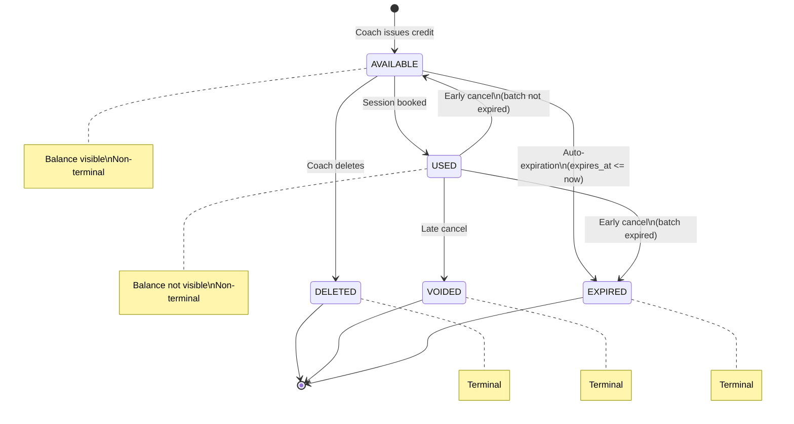

# Session Credits P1.1 — Credit Expiration: Technical Solution Design

> **Version:** 1.0 | **Author:** Duy Nguyen | **Date:** 2026-04-08
> **PRD:** Session Credits P1.1 - Credit Expiration | **Epic:** PAY-1901 | **Service:** Booking Service (MongoDB)
> **Prerequisite:** P1.0 fully shipped (session_credit_batches, session_credit_activities, balance, history, booking/cancel integration)

---

## 1. Overview

P1.1 adds expiration logic on top of the P1.0 Session Credits foundation. Coaches can set an expiration rule when issuing credits. The system automatically expires credits when the date passes, displays expiration groupings in the balance view, and notifies coaches of upcoming and completed expirations.

**Key Design Decisions:**

- Expiration is set **at issuance only** — immutable after creation
- No workspace-level default expiration rule in this release
- Only coaches are notified — clients receive no expiration notifications
- Expiration applies regardless of client archive status or workspace plan downgrade
- Two new scheduled jobs: auto-expiration (hourly) + 7-day alert (daily)

---

## 2. Database Design

### 2.1 Schema Changes to `session_credit_batches`

**New fields:**

| Field | Type | Required | Default | Description |
|-------|------|----------|---------|-------------|
| `expires_at` | DateTime | no | `null` | When credits in this batch expire. Null = never expires. **Immutable** after creation. |
| `quantity_expired` | Int | yes | `0` | Credits expired by the system auto-expiration job |

**Updated invariant:**

```
quantity_issued = quantity_available + quantity_used + quantity_deleted + quantity_expired
```

The previous P1.0 invariant (`issued = available + used + deleted`) is extended with `quantity_expired`.

**New index:**

```
(expires_at, quantity_available) — idx_expires_at_available
```

Used by the auto-expiration job to find batches where `expires_at <= now AND quantity_available > 0 AND expires_at IS NOT NULL`.

**Immutability rule:** `expires_at` cannot be updated after the batch is created. No API or internal path allows modification. This is enforced at the application layer (repository port does not expose an update method for this field).

### 2.2 Prisma Schema Change

```prisma
model SessionCreditBatch {
  // ... existing P1.0 fields ...
  expiresAt         DateTime?  @map("expires_at")         // P1.1
  quantityExpired   Int        @default(0) @map("quantity_expired")  // P1.1

  @@index([expiresAt, quantityAvailable], map: "idx_expires_at_available")  // P1.1
  // ... existing indexes ...
}
```

### 2.3 `expires_at` Calculation — `ceil_hour` Rule

The expiration date is calculated server-side using the **next full hour boundary** from the issuance timestamp:

```
expires_at = ceil_hour(issuance_timestamp) + N period
```

**`ceil_hour` rule:** Round the issuance timestamp up to the start of the next full hour.

| Issuance Time | `ceil_hour` Result |
|---|---|
| 9:55 AM | 10:00 AM |
| 10:00 AM exactly | 10:00 AM (already on the hour) |
| 2:01 PM | 3:00 PM |

**Duration addition rules:**
- **Days:** Add exact N days (e.g. `ceil_hour + 30 days`)
- **Weeks:** Add N * 7 days (e.g. `ceil_hour + 4 * 7 days`)
- **Months:** Calendar month addition (e.g. Apr 8 + 1 month = May 8). If target day doesn't exist (e.g. Jan 31 + 1 month), clamp to last day of target month (Feb 28/29).

**Valid duration limits (matching Trainerize):**

| Period | Min | Max |
|--------|-----|-----|
| Days | 1 | 365 |
| Weeks | 1 | 52 |
| Months | 1 | 36 |

**"Do not expire":** `expires_at = null`. These credits are never auto-expired.

**Example:**
```
Coach issues credits at 9:55 AM, Apr 8. Sets expiration = 30 days.
ceil_hour(9:55 AM, Apr 8) = 10:00 AM, Apr 8
expires_at = 10:00 AM, May 8
```

### 2.4 No Schema Changes to Other Models

- `session_credit_activities` — no schema change. The `expired` action value was already defined in P1.0 (`SessionCreditAction.EXPIRED`). P1.1 activates the writing logic.
- `session_types` — no schema change.

### 2.5 Updated Entity Relationship

```
┌─────────────────┐       ┌──────────────────────────────┐
│   SessionType    │       │   SessionCreditBatch         │
├─────────────────┤       ├──────────────────────────────┤
│ _id             │◄──────│ session_type_id               │
│ team_id         │       │ team_id                       │
│ require_session │       │ client_id                     │
│ _credit         │       │ quantity_issued               │
│ ...             │       │ quantity_available             │
└─────────────────┘       │ quantity_used                  │
                          │ quantity_deleted               │
                          │ quantity_expired (P1.1)        │
                          │ expires_at (P1.1, nullable)    │
                          │ issued_by                      │
                          │ issuance_note                  │
                          │ source                         │
                          │ usages[]                       │
                          │ version                        │
                          │ created_at                     │
                          └──────────────────────────────┘
```

---

## 3. Core Flows

### 3.1 Issue Session Credits — with Expiration Rule

**Trigger:** Coach clicks "Issue Credits" and optionally sets an expiration rule
**API:** `POST /v1/session-credits`

```
Coach                        Booking Service                     Notification
  │                               │                                   │
  │  POST /session-credits        │                                   │
  │  {clientId,                   │                                   │
  │   sessionTypeId,              │                                   │
  │   quantity: 4,                │                                   │
  │   note: "Monthly pkg",       │                                   │
  │   expiration_rule: "expires_  │                                   │
  │     after",                   │                                   │
  │   expiration_value: 30,       │                                   │
  │   expiration_unit: "days"}    │                                   │
  │ ────────────────────────────► │                                   │
  │                               │                                   │
  │                          ┌────┴────┐                              │
  │                          │Validate │                              │
  │                          │• All P1.0 validations                  │
  │                          │• expiration_value 1-365 (days)         │
  │                          │  OR 1-52 (weeks) OR 1-36 (months)     │
  │                          │• If "no_expire": skip above     │
  │                          └────┬────┘                              │
  │                               │                                   │
  │                          ┌────┴────┐                              │
  │                          │Calculate│                              │
  │                          │expires_at = ceil_hour(now) + 30 days  │
  │                          │(null if "no_expire")            │
  │                          └────┬────┘                              │
  │                               │                                   │
  │                          ┌────┴────┐                              │
  │                          │ Create  │                              │
  │                          │ Batch   │                              │
  │                          │ qty_issued: 4                          │
  │                          │ qty_available: 4                       │
  │                          │ qty_expired: 0                         │
  │                          │ expires_at: 2026-05-08T10:00:00Z      │
  │                          └────┬────┘                              │
  │                               │                                   │
  │                          ┌────┴────┐                              │
  │                          │Activity │ action: issued, qty: 4       │
  │                          └────┬────┘                              │
  │                               │                                   │
  │                               │──── publish event ───────────────►│
  │                               │     session_credit.issued          │
  │  ◄──── 201 Created ──────────│                                   │
  │  {batchId, balance with       │                                   │
  │   expiration groups}          │                                   │
```

**Validation rules (additions to P1.0):**

| Rule | Error |
|---|---|
| If `expiration_rule = "expires_after"`: `expiration_value` must be positive integer | "Must be greater than 0" |
| Days > 365 | "Must be 365 days or less" |
| Weeks > 52 | "Must be 52 weeks or less" |
| Months > 36 | "Must be 36 months or less" |
| If `expiration_rule = "no_expire"`: no value/unit required | Store `expires_at = null` |
| If `expiration_rule` not provided (backward compat) | Default to `no_expire`, store `expires_at = null` |

### 3.2 Delete Session Credits — Expiration-Aware Priority

**Trigger:** Coach deletes credits from client balance
**API:** `POST /v1/session-credits/delete`

**P1.1 changes the deletion order from FIFO to expiration-aware:**

```
Deletion priority order:
1. Soonest expires_at first (ASC, non-null only)
2. Tie on expires_at → oldest created_at first (ASC)
3. After all expiring credits exhausted → oldest non-expiring credits (created_at ASC)
```

```
Coach                    Booking Service
  │                           │
  │  POST /session-credits    │
  │  /delete                  │
  │  {clientId,               │
  │   sessionTypeId,          │
  │   quantity: 2,            │
  │   note: "Refund"}         │
  │ ────────────────────────► │
  │                           │
  │                      ┌────┴────┐
  │                      │ Find    │
  │                      │ batches │ WHERE client + type + qty_available > 0
  │                      │         │ ORDER BY:
  │                      │         │   CASE WHEN expires_at IS NOT NULL
  │                      │         │     THEN 0 ELSE 1 END ASC,
  │                      │         │   expires_at ASC,
  │                      │         │   created_at ASC
  │                      └────┬────┘
  │                           │
  │                      ┌────┴─────────────────────────────┐
  │                      │ Iterate batches, deduct:          │
  │                      │                                   │
  │                      │ Batch A (expires Mar 31, avail:1) │
  │                      │  → deduct 1, avail: 0             │
  │                      │                                   │
  │                      │ Batch B (expires Apr 30, avail:2) │
  │                      │  → deduct 1, avail: 1             │
  │                      │                                   │
  │                      │ Total deleted: 2                  │
  │                      └────┬─────────────────────────────┘
  │                           │
  │                      ┌────┴────┐
  │                      │Activity │ action: deleted, qty: 2
  │                      │         │ batchIds: [A, B]
  │                      └────┬────┘
  │                           │
  │  ◄──── 200 OK ───────────│
  │  {quantity_deleted: 2,    │
  │   quantity_remaining: 4,  │
  │   expiration_groups: [...]}│
```

**MongoDB sort for deletion query:**

```javascript
db.session_credit_batches.find({
  clientId: clientId,
  sessionTypeId: sessionTypeId,
  quantityAvailable: { $gt: 0 }
}).sort({
  // Non-null expires_at first, then by soonest date, then by oldest creation
  expiresAt: 1,  // null sorts last in MongoDB ascending
  createdAt: 1
})
```

> **Note:** In MongoDB, `null` values sort **before** non-null values in ascending order. We need to handle this: either use an aggregation pipeline with `$cond` to push nulls last, or use a two-phase query (first expiring batches sorted by `expiresAt ASC`, then non-expiring batches sorted by `createdAt ASC`).

**Atomicity:** Same as P1.0 — MongoDB transaction (`$transaction`) ensures all-or-nothing across multiple batch updates.

### 3.3 Book Session — Use Credit (FIFO, Unchanged)

**No change from P1.0.** The booking flow continues to use pure FIFO order (`created_at ASC`) for credit selection. The P1.1 spec only changes deletion priority to be expiration-aware — booking remains oldest-first.

```
findAvailableBatchesFIFO query (unchanged):
  ORDER BY: created_at ASC
```

All booking logic (optimistic locking, retry, per-client deduction for group sessions) remains unchanged from P1.0.

### 3.4 Cancel Session — Return Credit (with Expiration Check)

**P1.1 addition:** On early cancel, check if the batch's `expires_at` has passed before returning the credit.

```
Coach                Sessions Module          SessionCredits Module
  │                       │                          │
  │  PATCH /sessions/:id  │                          │
  │  {action: cancel}     │                          │
  │ ─────────────────────►│                          │
  │                       │                          │
  │                  EARLY CANCEL                    │
  │                       │  returnCredit()           │
  │                       │ ────────────────────────►│
  │                       │                          │
  │                       │                     ┌───┴─────────────────┐
  │                       │                     │ Check: batch        │
  │                       │                     │ expires_at <= now?  │
  │                       │                     │                     │
  │                       │                     │ YES → USED→EXPIRED  │
  │                       │                     │   • qty_used--      │
  │                       │                     │   • qty_expired++   │
  │                       │                     │   • Activity:       │
  │                       │                     │     returned (qty:1)│
  │                       │                     │     expired (qty:1) │
  │                       │                     │                     │
  │                       │                     │ NO → USED→AVAILABLE │
  │                       │                     │   • qty_used--      │
  │                       │                     │   • qty_available++ │
  │                       │                     │   • Activity:       │
  │                       │                     │     returned (qty:1)│
  │                       │                     └───┬─────────────────┘
  │                       │                         │
  │                       │ ◄──── { success } ──────│
  │  ◄── 200 OK ─────────│                         │
```

**Implementation choice:** Handle the expiration check **within the cancel flow itself** (not waiting for the next scheduler run). Credit transitions directly from `USED` to `EXPIRED` — it never becomes `AVAILABLE`.

**Late cancel:** Unchanged from P1.0. Credit is voided — no expiration check needed.

### 3.5 View Credit Balance — Grouped by Expiration

**API:** `GET /v1/session-credits/balance/:clientId`

**P1.1 changes the response structure.** Within each session type, available credits are grouped by `expires_at` value.

**Grouping rules:**

| Group | Condition | Sort Order |
|---|---|---|
| Expiring groups | `expires_at IS NOT NULL` and `quantity_available > 0` | Soonest `expires_at` first |
| Non-expiring group | `expires_at IS NULL` and `quantity_available > 0` | Shown last |

**Aggregation:** Credits from different batches with the **same `expires_at`** value are accumulated into a single group.

**Empty groups:** Groups with 0 available credits are **excluded** from the response.

**Expiring-soon computation (at query time):**

```
For each group where expires_at IS NOT NULL:
  countdown_days = floor((expires_at - now) / 86400000)
  is_expiring_soon = countdown_days >= 0 AND countdown_days <= 7
```

**MongoDB aggregation pipeline:**

```javascript
db.session_credit_batches.aggregate([
  { $match: { clientId, teamId, quantityAvailable: { $gt: 0 } } },
  { $group: {
      _id: { sessionTypeId: "$sessionTypeId", expiresAt: "$expiresAt" },
      available: { $sum: "$quantityAvailable" }
  }},
  { $sort: { "_id.expiresAt": 1 } },  // null last handled in app layer
  { $group: {
      _id: "$_id.sessionTypeId",
      expiration_groups: { $push: { expires_at: "$_id.expiresAt", available: "$available" } },
      total_available: { $sum: "$available" }
  }}
])
```

**Response structure:** See API contracts document.

### 3.6 View Credit History — with `expired` Filter

**API:** `GET /v1/session-credits/history/:clientId`

**P1.1 change:** The `action` query param now accepts `expired` as a filter value, in addition to the existing values (`issued`, `used`, `returned`, `voided`, `deleted`).

**Event filter order in UI:** Issued -> Used -> Returned -> Voided -> **Expired** -> Deleted

No schema or query logic changes needed — the `FindHistoryParams.action` filter already supports any `SessionCreditAction` enum value, and `EXPIRED` was defined in P1.0.

---

## 4. New Scheduled Jobs

### 4.1 Auto-Expiration Job (Hourly)

**Purpose:** Find and expire credits that have passed their expiration date.

**Cadence:** Every hour via `@Cron(CRON_PATTERNS.EVERY_HOUR)`. Because `expires_at` is always set to a full hour boundary (`ceil_hour`), an hourly scan aligns naturally with when credits become eligible.

**Architecture:** Follows the existing scheduler→worker pattern:
1. `SessionCreditExpirationScheduler` publishes a cron trigger message to SQS topic
2. `SessionCreditExpirationCronProcessor` (worker) consumes the message and executes the scan

```
Scheduler (hourly)               Worker Processor              Database
       │                              │                           │
  Publish cron trigger ──────────────►│                           │
       │                              │                           │
       │                         Find batches where:              │
       │                         • quantityAvailable > 0          │
       │                         • expiresAt <= now               │
       │                         • expiresAt IS NOT NULL          │
       │                         ────────────────────────────────►│
       │                              │◄─── expired batches ──────│
       │                              │                           │
       │                         For each batch:                  │
       │                         ┌────┴────────────────────┐      │
       │                         │ Update batch:            │      │
       │                         │  qty_expired +=          │      │
       │                         │    qty_available         │      │
       │                         │  qty_available = 0       │      │
       │                         │  version++               │      │
       │                         └────┬────────────────────┘      │
       │                              │                           │
       │                         Group by client:                 │
       │                         ┌────┴────────────────────┐      │
       │                         │ Per client+sessionType:  │      │
       │                         │  Create activity record  │      │
       │                         │  action: expired         │      │
       │                         │  qty: total expired      │      │
       │                         │  performedBy: null       │      │
       │                         └────┬────────────────────┘      │
       │                              │                           │
       │                         Per client (consolidated):       │
       │                         ┌────┴────────────────────┐      │
       │                         │ Publish event to         │      │
       │                         │ TOPIC_SESSION_CREDIT_    │      │
       │                         │ EXPIRED (one per client) │      │
       │                         │ → consumed by everfit-api│      │
       │                         │   to send notification   │      │
       │                         └─────────────────────────┘      │
```

**Batching and consolidation:**

- **Activity records:** One `expired` activity per client + session type per job run. If client has 3 credits expiring for "PT Session" in a single run, write one record with `quantity: 3`.
- **Published events:** One event per client per job run on `TOPIC_SESSION_CREDIT_EXPIRED`. If a client has credits for multiple session types expiring, publish a single consolidated event with the total count and per-session-type breakdown. **The booking service does not send notifications directly** — `everfit-api` consumes this topic and produces the actual push / email / in-app / updates-feed entries.

**`ceil_hour` alignment:** Because `expires_at` is always set to a full hour boundary, credits become eligible on the exact hour. The hourly job interval means a credit expiring at 10:00 AM is processed by the 10:00 AM run (or at most the 11:00 AM run if the 10:00 AM run is delayed). Worst-case user-visible lag is ~1 hour between `expires_at` and the batch being marked expired.

**WS/client status:** The job does NOT check workspace plan or client archive status. Credits expire regardless.

**Concurrency safety:** Use `findOneAndUpdate` with `quantityAvailable: { $gt: 0 }` condition to prevent double-expiration if two job runs overlap.

### 4.2 Expiring-Soon Alert Job (Daily)

**Purpose:** Send a 7-day advance warning notification to coaches when client credits are about to expire.

**Cadence:** Daily via `@Cron(CRON_PATTERNS.EVERY_DAY_AT_MIDNIGHT)` (or configured timezone).

**Architecture:** Same scheduler→worker pattern as auto-expiration.

```
Scheduler (daily)                Worker Processor              Database
       │                              │                           │
  Publish cron trigger ──────────────►│                           │
       │                              │                           │
       │                         Find batches where:              │
       │                         • quantityAvailable > 0          │
       │                         • expiresAt falls on             │
       │                           today + 7 days (date match)    │
       │                         ────────────────────────────────►│
       │                              │◄─── expiring batches ─────│
       │                              │                           │
       │                         Group by client:                 │
       │                         ┌────┴────────────────────┐      │
       │                         │ Per client:              │      │
       │                         │  Total credits expiring  │      │
       │                         │  across all session types│      │
       │                         │  Publish ONE event to    │      │
       │                         │  TOPIC_SESSION_CREDIT_   │      │
       │                         │  EXPIRING_SOON           │      │
       │                         │  → consumed by everfit-  │      │
       │                         │    api to notify coach   │      │
       │                         └─────────────────────────┘      │
```

**"Today + 7 days" date comparison:**

```javascript
const targetDate = startOfDay(addDays(now(), 7));
const targetDateEnd = endOfDay(addDays(now(), 7));

db.session_credit_batches.find({
  quantityAvailable: { $gt: 0 },
  expiresAt: { $gte: targetDate, $lte: targetDateEnd }
})
```

**Edge case — Issuance with < 7 days until expiry:** If a coach issues credits with `expires_at` less than 7 days from today, **no expiring-soon event is published**. The daily job only triggers for credits whose `expires_at` falls on the target date. This avoids duplicate notifications at issuance time.

**Consolidation:** One event per client per job run on `TOPIC_SESSION_CREDIT_EXPIRING_SOON`, covering all session types. `everfit-api` consumes the event and composes the actual coach notification (message, deep-link, updates-feed entry).

### 4.3 New DI Tokens and Queue Topics

**DI tokens** (in `core/constants/index.ts`):

```typescript
export const EXPIRE_SESSION_CREDITS_USE_CASE = Symbol('EXPIRE_SESSION_CREDITS_USE_CASE');
export const NOTIFY_EXPIRING_SOON_USE_CASE = Symbol('NOTIFY_EXPIRING_SOON_USE_CASE');
```

**Queue topics** (in `workers/constants/index.ts`):

```typescript
export const TOPIC_SESSION_CREDIT_EXPIRATION_CRON = 'bk-session-credit-expiration-cron';
export const TOPIC_SESSION_CREDIT_EXPIRING_SOON_CRON = 'bk-session-credit-expiring-soon-cron';
export const TOPIC_SESSION_CREDIT_EXPIRED = 'bk-session-credit-expired';
export const TOPIC_SESSION_CREDIT_EXPIRING_SOON = 'bk-session-credit-expiring-soon';
```

---

## 5. Balance Visibility — Expiration Groups

### 5.1 Balance Card (per Session Type)

Each session type in the balance response now contains `expiration_groups` — an array of groups sorted by `expires_at ASC NULLS LAST`.

**Group accumulation:** Multiple batches with the same `expires_at` value are summed into one group.

**Empty group filtering:** Groups where `available = 0` are excluded.

**Expiring-soon detection (computed at query time):**

```
countdown_days = ceil((expires_at - now) / (24 * 60 * 60 * 1000))
is_expiring_soon = expires_at IS NOT NULL AND countdown_days >= 1 AND countdown_days <= 7
```

Display rule:
- `countdown_days = 1` -> "1 day"
- `countdown_days > 1` -> "{countdown_days} days"

### 5.2 Session Type Details Pop-up — Expiration Section

The pop-up response uses the same `expiration_groups` structure. The "EXPIRATIONS" section shows:

- Groups with expiration: `"{x} credit(s) expire {date}"` — soonest first
- Non-expiring group: `"{y} credit(s) don't expire"` — shown last
- Groups expiring within 7 days: red highlight + countdown text

**Singular/plural rules:**

| Count | Expiring text | Non-expiring text |
|---|---|---|
| 1 | "1 credit expires" | "1 credit doesn't expire" |
| > 1 | "{x} credits expire" | "{x} credits don't expire" |

**Date formatting:**

| Condition | Format | Example |
|---|---|---|
| Same year as current | No year shown | "Mar 31" |
| Different year | Show year | "Mar 31, 2027" |

### 5.3 Non-Dismissible Alert on Client Overview

When a client has any `available` credits with `expires_at` within 7 days, the client Overview shows an alert for the **soonest** expiring group.

**API:** The balance endpoint returns an `expiring_soon_alert` object at the top level:

```json
{
  "expiring_soon_alert": {
    "session_type_id": "abc123",
    "session_type_name": "1:1 Training",
    "quantity": 3,
    "expires_at": "2026-04-15T10:00:00.000Z",
    "countdown_days": 5
  }
}
```

`null` if no credits expire within 7 days.

**Alert disappears when:**
- All credits in the expiring group are used, deleted, or expired
- No other credits within 7 days remain

---

## 6. Notification Events

### 6.0 Cross-Service Responsibility

The booking service **does not send notifications directly**. Notifications (push, email, in-app, updates feed) are owned by `everfit-api`. This service only **publishes domain events to Kafka/SQS topics**; `everfit-api` subscribes to those topics and composes/delivers the final notification using the existing notification pipeline.

```
Booking Service                  Queue (Kafka/SQS)            everfit-api
      │                                │                           │
      │  publish(topic, payload)       │                           │
      │ ──────────────────────────────►│                           │
      │                                │ ──── consume ────────────►│
      │                                │                           │
      │                                │                      ┌────┴────┐
      │                                │                      │ Compose │
      │                                │                      │ message │
      │                                │                      │ Resolve │
      │                                │                      │ recipients
      │                                │                      │ Send push/
      │                                │                      │ email/in-app/
      │                                │                      │ updates feed
      │                                │                      └─────────┘
```

This matches the existing P1.0 pattern for `session_credit.issued` and `session_credit.deleted`, which the booking service also only publishes to queue topics — the notification rendering lives in `everfit-api`.

**Boundary responsibilities:**

| Concern | Owner |
|---|---|
| Deciding *when* a credit event occurs (issued, expired, expiring soon, etc.) | Booking Service |
| Writing the activity log and updating balance | Booking Service |
| Publishing the domain event to the queue topic | Booking Service |
| Subscribing to the topic | everfit-api |
| Rendering message copy (singular/plural, translation, icon) | everfit-api |
| Resolving notification recipients (coach, admins) | everfit-api |
| Applying notification category/settings (e.g. "Cannot be turned off") | everfit-api |
| Computing deep-links (web / mobile) | everfit-api |
| Writing the Updates Feed entry | everfit-api |
| Delivering push / email / in-app | everfit-api |

### 6.1 Published Event Table

| Topic Constant | Topic Name | Trigger | Producer | Consumer |
|---|---|---|---|---|
| `TOPIC_BK_SESSION_CREDIT_ISSUED` | `bk-session-credit-issued` | Issuance use case | Booking Service | everfit-api (unchanged from P1.0) |
| `TOPIC_SESSION_CREDIT_DELETED` | `bk-session-credit-deleted` | Deletion use case | Booking Service | everfit-api (unchanged from P1.0) |
| **`TOPIC_SESSION_CREDIT_EXPIRED`** | **`bk-session-credit-expired`** | Auto-expiration cron worker | Booking Service | everfit-api |
| **`TOPIC_SESSION_CREDIT_EXPIRING_SOON`** | **`bk-session-credit-expiring-soon`** | 7-day alert cron worker | Booking Service | everfit-api |

### 6.2 Event Payload Schemas

**`bk-session-credit-expired` payload** — published once per client per auto-expiration run:

```typescript
export interface SessionCreditExpiredMessage {
  team_id: string;
  client_id: string;
  // Total across all session types for this client, used for the coach-facing message.
  total_quantity: number;
  // Per session-type breakdown so everfit-api can produce richer copy / deep-link targeting if needed.
  items: Array<{
    session_type_id: string;
    quantity: number;
  }>;
  // ISO timestamp when the job completed the expiration (not the batch expires_at, which may differ per batch).
  expired_at: string;
}
```

**`bk-session-credit-expiring-soon` payload** — published once per client per daily-alert run:

```typescript
export interface SessionCreditExpiringSoonMessage {
  team_id: string;
  client_id: string;
  // Total credits across all session types expiring on the target date.
  total_quantity: number;
  // The shared expiration date being warned about (today + 7 days, ceil-hour aligned).
  expires_at: string;  // ISO timestamp
  items: Array<{
    session_type_id: string;
    quantity: number;
  }>;
}
```

**Design notes:**
- Both events omit rendered copy (e.g. `"has 4 session credits that will expire..."`). Copy lives in `everfit-api` so it can be localized and changed without a booking-service deploy.
- `performedBy` / `actor` is intentionally absent — these are system-initiated events. `everfit-api` treats them as system actor when rendering.
- Payload follows the existing snake_case queue-message convention (see `session-credit-queue-message-v1.mapper.ts`).

### 6.3 Publisher Port Extension

`ISessionCreditEventPublisher` gains two new methods (application layer, ORM-free):

```typescript
export interface PublishCreditExpiredParams {
  teamId: string;
  clientId: string;
  totalQuantity: number;
  items: Array<{ sessionTypeId: string; quantity: number }>;
  expiredAt: Date;
}

export interface PublishCreditExpiringSoonParams {
  teamId: string;
  clientId: string;
  totalQuantity: number;
  expiresAt: Date;
  items: Array<{ sessionTypeId: string; quantity: number }>;
}

export interface ISessionCreditEventPublisher {
  // ... existing P1.0 methods
  publishSessionCreditExpired(params: PublishCreditExpiredParams): Promise<void>;
  publishSessionCreditExpiringSoon(params: PublishCreditExpiringSoonParams): Promise<void>;
}
```

The infrastructure `SessionCreditEventPublisher` routes each call through `IQueueService.publish({ topic, data })`, reusing the existing Kafka/SQS strategy. New mapper functions `toSessionCreditExpiredMessage` and `toSessionCreditExpiringSoonMessage` convert the port params into the snake_case wire format.

### 6.4 Coach-Facing Message Reference (Owned by everfit-api)

The booking service does **not** render these strings. They are documented here only so the product contract between the two services is clear.

**Auto-expiration notification** (rendered by everfit-api from `bk-session-credit-expired`):

| Field | Value |
|---|---|
| Icon | `$` |
| Singular | "1 session credit expires" |
| Plural | "{X} session credits expire" |
| Web deep-link | Client Sessions tab, anchored to Activities section |
| Mobile deep-link | Client profile, Overview tab |
| Updates feed | Same content, same web deep-link on click |
| Consolidation | One event = one notification per client |

**Expiring-soon notification** (rendered by everfit-api from `bk-session-credit-expiring-soon`):

| Field | Value |
|---|---|
| Icon | `$` |
| Message | `"{Client name} has {X} session credit(s) that will expire in 7 days on {DATE}."` |
| Example | "Esther Howard has 4 session credits that will expire in 7 days on Mar 10, 2026." |
| Category | Admin |
| Settings | Cannot be turned off in P1.1 |
| Web deep-link | Client Sessions tab |
| Mobile deep-link | Client profile, Overview tab |
| Consolidation | One event = one notification per client |

### 6.5 Delivery Semantics

- **Fire-and-forget:** publish happens after DB commit. If publish fails, the auto-expiration DB state is still correct (credits are marked expired); the event is lost for that run. Acceptable for P1.1 — the next daily alert / the balance view still surface the state.
- **At-least-once:** `everfit-api` consumers should treat these events as idempotent. Include a deterministic de-dup key if needed (e.g. `{client_id}:{expired_at-bucket}`).
- **Ordering:** not guaranteed across topics. `everfit-api` must not assume `expiring_soon` always precedes `expired` for the same batch — a client-issued batch with < 7 days runway skips the soon event entirely (see §4.2 edge case).

### 6.6 No Client Notifications

Clients are NOT notified when credits expire or are about to expire. This is intentional for P1.1. Since notification recipient resolution lives in `everfit-api`, this means the `everfit-api` consumer for these two topics routes to coach/admin recipients only.

---

## 7. Activity Log Updates

### 7.1 Updated Activity Table

| Action | Type | Amount | Actor | Session Ref | Notes |
|---|---|---|---|---|---|
| Coach issues credits | `issued` | `+qty` | Coach | -- | Unchanged |
| Coach deletes credits | `deleted` | `-qty` | Coach | -- | Unchanged |
| Credit used at booking | `used` | `-1` | System (null) | Yes | Unchanged |
| Credit returned on cancel | `returned` | `+1` | System (null) | Yes | Unchanged |
| Credit voided on late cancel | `voided` | `0` | System (null) | Yes | Unchanged |
| **Credit expired by system** | **`expired`** | **`-qty`** | **System (null)** | -- | **P1.1** |

### 7.2 Expiration Activity Record

- **Actor:** `null` (system-initiated)
- **Amount:** Negative count of credits expired
- **Batching:** One activity record per client + session type per job run
- **Appears in:** Balance History table, "Expired" filter tab

### 7.3 Event Filter Order

Updated filter order in Balance History:

```
All | Issued | Used | Returned | Voided | Expired | Deleted
```

---

## 8. Edge Cases

### 8.1 Early Cancel After Expiry Date Has Passed

If a session was booked using a credit, the credit's `expires_at` has since passed (credit was in `used` status during expiration), and the coach performs an early cancel:

1. Check `batch.expiresAt <= now`
2. If yes: credit transitions directly from `USED` to `EXPIRED` — `qty_used--`, `qty_expired++`, `version++`
3. Write two activity records: `returned` (qty: 1), then `expired` (qty: 1)
4. Credit never becomes `AVAILABLE` — it is never visible in client's available balance
5. If no: normal return to `AVAILABLE` (standard early cancel flow)

**Implementation:** Handle in `ReturnSessionCreditV1UseCase.execute()` — check expiration before returning, and route to expire logic directly if the batch has expired.

### 8.2 Archived Client

- `expires_at` unchanged on archive
- Auto-expiration job still runs and expires credits
- 7-day alert job still sends notifications to coach
- Booking already gated on active client status

### 8.3 Workspace Downgraded to Starter

- Credits preserved (P1.0 rule)
- `expires_at` values unchanged
- Auto-expiration job runs even while Booking access is disabled
- On re-subscribe: balance reflects what happened during downgrade

### 8.4 Delete Credits Affecting Expiring-Soon Alert

If coach deletes credits that triggered the Overview expiring-soon alert:
- Alert removed if no other credits within 7 days remain
- Alert updates to next qualifying batch if one exists

### 8.5 Issuance with Expiration <= 7 Days

If a coach issues credits with `expires_at` within 7 days:
- **No special alert at issuance time**
- The 7-day alert job only fires based on its daily scan
- The expiring-soon visual treatment in the balance view is computed at query time and will show immediately

---

## 9. Credit State Machine

P1.1 activates the `expired` terminal state that was reserved in P1.0.



### 9.1 Status Transition Table

| From | To | Action / Trigger | Actor |
|---|---|---|---|
| *(initial)* | **AVAILABLE** | Coach issues credit | Coach |
| AVAILABLE | **USED** | Session booked (credit consumed) | System |
| AVAILABLE | **DELETED** | Coach deletes credit | Coach |
| AVAILABLE | **EXPIRED** | Auto-expiration job (`expires_at <= now`) | System (scheduler) |
| USED | **AVAILABLE** | Early cancel (batch not expired) | System |
| USED | **VOIDED** | Late cancel | System |
| USED | **EXPIRED** | Early cancel (batch expired, `expires_at <= now`) | System |

### 9.2 State Summary

| State | Available Balance? | Terminal? |
|---|---|---|
| `available` | Yes | No |
| `used` | No | No |
| `voided` | No | Yes |
| `deleted` | No | Yes |
| `expired` | No | Yes |

**Early Cancel on expired batch:** Credit transitions directly from `USED` to `EXPIRED` — it never becomes `AVAILABLE`. Two activity records are written: `returned` (+1) then `expired` (-1).

---

## 10. File Structure (New/Modified)

### 10.1 New Files

```
src/
├── modules/session-credits/
│   ├── application/
│   │   ├── v1/use-cases/
│   │   │   └── expire-session-credits-v1.use-case.ts      # Auto-expiration logic
│   │   └── v1/mappers/
│   │       └── (update existing mappers for expiration groups)
│   ├── infrastructure/
│   │   └── publishers/
│   │       └── (update existing publisher for expired/expiring-soon events)
│   └── domain/
│       └── (update existing constants if needed)
│
├── schedulers/
│   └── jobs/
│       ├── session-credit-expiration.scheduler.ts          # Hourly cron trigger
│       └── session-credit-expiring-soon.scheduler.ts       # Daily cron trigger
│
└── workers/
    └── processors/
        ├── session-credit-expiration-cron.processor.ts     # Expiration job worker
        └── session-credit-expiring-soon-cron.processor.ts  # 7-day alert worker
```

### 10.2 Modified Files

```
prisma/schema.prisma                                        # Add expiresAt, quantityExpired
src/core/constants/index.ts                                 # New DI tokens
src/core/constants/socket-events.constant.ts                # New socket event (if needed)
src/workers/constants/index.ts                              # New queue topics
src/modules/session-credits/application/ports/
    session-credit-batch-repository.port.ts                 # New methods for expiration
src/modules/session-credits/application/v1/use-cases/
    issue-session-credits-v1.use-case.ts                    # expires_at calculation
    return-session-credit-v1.use-case.ts                    # Post-return expiration check
    use-session-credit-v1.use-case.ts                       # Updated FIFO order
    delete-session-credits-v1.use-case.ts                   # Expiration-aware priority
    get-session-credit-balance-v1.use-case.ts               # Expiration grouping
src/modules/session-credits/application/v1/dtos/
    issue-session-credits-v1.dto.ts                         # Expiration fields
    session-credit-balance-response-v1.dto.ts               # Expiration groups
src/modules/session-credits/infrastructure/repositories/
    session-credit-batch-prisma.repository.ts               # Updated queries
src/modules/session-credits/application/ports/
    session-credit-event-publisher.port.ts                  # + publishSessionCreditExpired, publishSessionCreditExpiringSoon
src/modules/session-credits/application/v1/mappers/
    session-credit-queue-message-v1.mapper.ts               # + toSessionCreditExpiredMessage, toSessionCreditExpiringSoonMessage
src/modules/session-credits/infrastructure/publishers/
    session-credit-event.publisher.ts                       # Publish to TOPIC_SESSION_CREDIT_EXPIRED / EXPIRING_SOON via IQueueService
src/modules/session-credits/session-credits.module.ts       # New providers
src/schedulers/schedulers.module.ts                         # Import new schedulers
src/workers/workers.module.ts                               # Import new processors
```

---

## 11. Open Questions

| # | Question | Recommendation | Status |
|---|---|---|---|
| 1 | **`ceil_hour` month addition:** Calendar month (Apr 8 + 1mo = May 8) or fixed 30 days? | Calendar month addition for months, 7-day weeks, exact days | Pending Tech Lead |
| 2 | **Auto-expiration job cadence:** Hourly confirmed? | Hourly — aligns with `ceil_hour` expiration boundary; ~1h worst-case lag is acceptable | **Resolved** |
| 3 | **Early cancel after expiry:** Same transaction or next job run? | Same cancel flow — avoids stale available balance window | Pending Tech Lead |
| 4 | **Expiration activity batching:** Per credit or per client+session_type per job run? | One consolidated record per client+session_type per job run | Pending Tech Lead |
| 5 | **7-day alert timing:** Fixed time daily (midnight UTC) or WS timezone? | Fixed time (midnight UTC or WS timezone midnight) | Pending Tech Lead |
| 6 | **FIFO at booking:** Should booking also use soonest-to-expire first (matching delete priority)? | **No** — P1.1 spec only changes delete order. Booking stays pure FIFO (`created_at ASC`). | **Resolved** |
| 7 | **MongoDB null sort:** `null` sorts before non-null in ascending. Use two-phase query or aggregation `$cond`? | Two-phase query (expiring batches first, then non-expiring) — simpler and avoids aggregation overhead | Pending Tech Lead |

---

## 12. P1.0 vs P1.1 Scope Summary

| Feature | P1.0 | P1.1 |
|---------|------|------|
| `require_session_credit` on session types | Yes | -- |
| Issue credits (manual) | Yes | + expiration rule |
| `expires_at` field on batch | -- | Yes (nullable, immutable) |
| `quantity_expired` field on batch | -- | Yes |
| `ceil_hour` expiration calculation | -- | Yes |
| Delete credits: oldest first (FIFO) | Yes | Soonest-to-expire first |
| Use credit at booking (FIFO) | Yes | Unchanged — stays FIFO (`created_at ASC`) |
| Return credit on early cancel | Yes | + immediate expire if past date |
| Credit balance view | Yes | + expiration grouping, countdown |
| Credit history view | Yes | + `expired` filter |
| Archive warning | Yes | -- |
| Auto-expiration scheduler (hourly) | -- | Yes |
| 7-day expiring-soon alert (daily) | -- | Yes |
| Expiring-soon UI alert (Overview) | -- | Yes |
| Expiration notification (delivered by everfit-api) | -- | Yes |
| Expiring-soon notification (delivered by everfit-api) | -- | Yes |
| Updates feed entry for expiration | -- | Yes (rendered by everfit-api from published event) |
| Publish `bk-session-credit-expired` topic | -- | Yes (consumed by everfit-api) |
| Publish `bk-session-credit-expiring-soon` topic | -- | Yes (consumed by everfit-api) |

---

*Prepared by: Duy Nguyen (BE) | Source: P1.1 Confluence Spec + BA Logic Reference | April 8, 2026*
