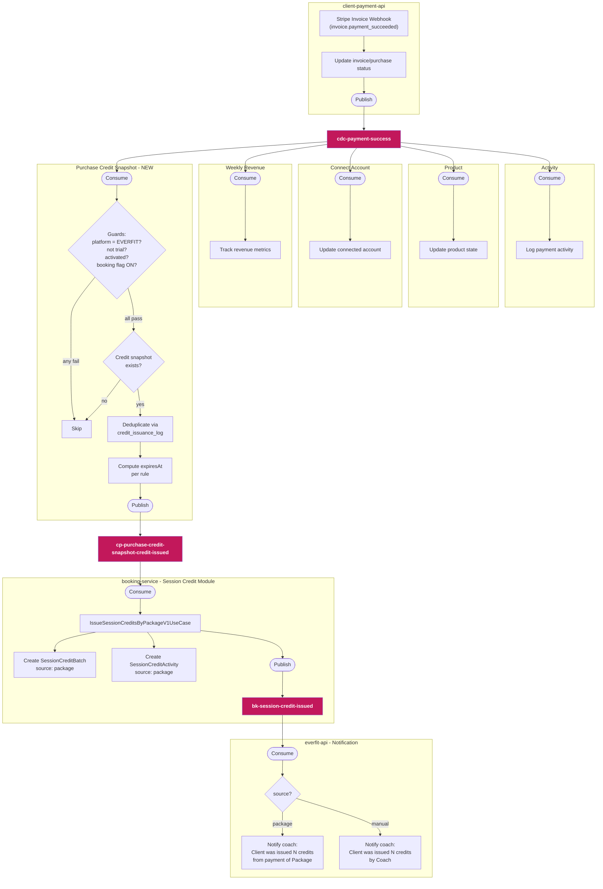
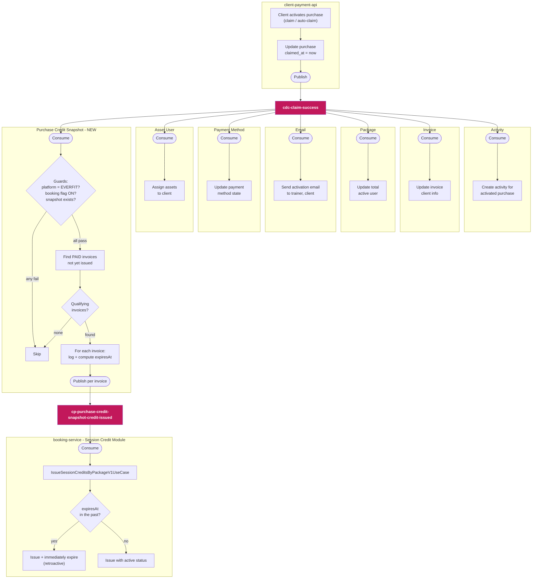
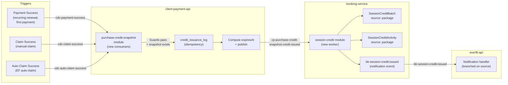
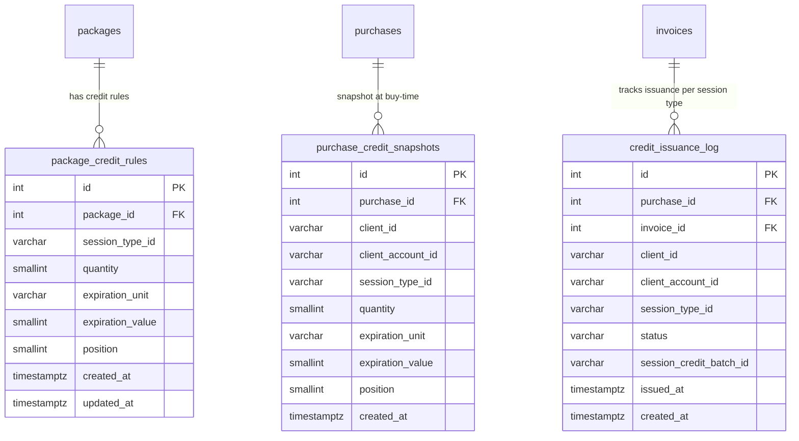

# Technical Solution Design: [Spec 3.1] Session Credits — Package Issuance

**PRD Reference:** `package_credit_issuance.md`
**Repos:** `client-payment-api` (TypeORM + PostgreSQL) · `booking-service` (Prisma + MongoDB)
**Status:** Draft v2 — revised from source code review

---

## 1. Architecture Overview

### Approach

The feature is split cleanly across two services along their existing ownership boundaries:

| Concern | Service | Storage |
|---|---|---|
| Package credit rule configuration | `client-payment-api` | PostgreSQL |
| Purchase credit snapshot (immutable at buy-time) | `client-payment-api` | PostgreSQL |
| Credit issuance dedup / audit log | `client-payment-api` | PostgreSQL |
| Payment event processing (Stripe webhooks) | `client-payment-api` | — |
| Credit issuance, batch tracking, balance, history | `booking-service` | MongoDB (`session_credit_batches`, `session_credit_activities`) |
| Session type eligibility validation | `booking-service` | MongoDB (`session_types`) |

### Inter-Service Communication

`client-payment-api` already routes Stripe invoice webhooks to a FIFO SQS queue (`CDC_STRIPE_INVOICE_WEBHOOK_FIFO`) which is consumed internally. After payment is confirmed and all guard conditions pass, a new `purchase-credit-snapshot` module consumes the existing `CDC_PAYMENT_SUCCESS` fan-out topic, checks for credit snapshots, and publishes `cp-purchase-credit-snapshot-credit-issued` to SQS. `booking-service` consumes this via a new worker processor.

This matches the existing queue-driven pattern (`PurchaseProducer`, `InvoiceProducer`, `StripeProducer`).

**Platform constraint:** Session credits are only issued for purchases where `platform = EVERFIT`. Marketplace purchases are excluded from snapshot creation and all issuance triggers.

#### Diagram 1: Payment Success → Credit Issuance



#### Diagram 2: Claim Success → Retroactive Credit Issuance



#### Diagram 3: End-to-End Credit Issuance — All Triggers



### New Libraries / Dependencies

None required in either service. Uses existing `@everfit-io/module-queue`, Prisma, TypeORM patterns.

---

## 2. Database Design

### 2.1 PostgreSQL — `client-payment-api`

#### ER Diagram



**Note on `package_credit_rules` link:** Credit rules are stored at the `package_id` level, not `price_id`. The spec treats credit configuration as a package-level setting configured alongside (but independently of) the pricing plan.

#### DDL / Migrations

```sql
-- Migration 1: package_credit_rules
-- Business constraints (max 5 rules, unique session_type per package) are enforced
-- at the application layer, not via DB constraints.
CREATE TABLE package_credit_rules (
    id               SERIAL PRIMARY KEY,
    package_id       INT NOT NULL REFERENCES packages(id) ON DELETE CASCADE,
    session_type_id  VARCHAR(255) NOT NULL,
    quantity         SMALLINT NOT NULL,
    expiration_unit  VARCHAR(20) NOT NULL,  -- 'days' | 'weeks' | 'months'
    expiration_value SMALLINT NOT NULL,
    position         SMALLINT NOT NULL DEFAULT 0,
    created_at       TIMESTAMPTZ NOT NULL DEFAULT NOW(),
    updated_at       TIMESTAMPTZ NOT NULL DEFAULT NOW()
);

CREATE INDEX idx_pcr_package_id ON package_credit_rules(package_id);

-- Migration 2: purchase_credit_snapshots
-- Immutable: no updated_at. Only credit rule fields — display data (name, color,
-- duration, location_type) is fetched live from booking-service at read time.
CREATE TABLE purchase_credit_snapshots (
    id                 SERIAL PRIMARY KEY,
    purchase_id        INT NOT NULL REFERENCES purchases(id) ON DELETE CASCADE,
    client_id          VARCHAR(255) NOT NULL,  -- MongoDB profile ObjectId
    client_account_id  VARCHAR(255) NOT NULL,  -- account-level ID
    session_type_id    VARCHAR(255) NOT NULL,
    quantity           SMALLINT NOT NULL,
    expiration_unit    VARCHAR(20) NOT NULL,
    expiration_value   SMALLINT NOT NULL,
    position           SMALLINT NOT NULL DEFAULT 0,
    created_at         TIMESTAMPTZ NOT NULL DEFAULT NOW()
);

CREATE INDEX idx_pcs_purchase_id ON purchase_credit_snapshots(purchase_id);
CREATE INDEX idx_pcs_client_id ON purchase_credit_snapshots(client_id);

-- Migration 3: credit_issuance_log
-- Uniqueness on (invoice_id, session_type_id) IS the idempotency mechanism.
-- No separate hash/idempotency_key column needed.
-- session_credit_batch_id: the MongoDB ObjectId returned by booking-service
-- after successful batch creation.
CREATE TABLE credit_issuance_log (
    id                       SERIAL PRIMARY KEY,
    purchase_id              INT NOT NULL REFERENCES purchases(id),
    invoice_id               INT NOT NULL REFERENCES invoices(id),
    client_id                VARCHAR(255) NOT NULL,  -- MongoDB profile ObjectId
    client_account_id        VARCHAR(255) NOT NULL,  -- account-level ID
    session_type_id          VARCHAR(255) NOT NULL,
    status                   VARCHAR(20) NOT NULL DEFAULT 'pending'
                                 CHECK (status IN ('pending', 'issued', 'failed')),
    session_credit_batch_id  VARCHAR(255),  -- MongoDB ObjectId from booking-service
    issued_at                TIMESTAMPTZ,
    created_at               TIMESTAMPTZ NOT NULL DEFAULT NOW(),
    CONSTRAINT uq_issuance_invoice_session_type UNIQUE (invoice_id, session_type_id)
);

CREATE INDEX idx_cil_purchase_id ON credit_issuance_log(purchase_id);
CREATE INDEX idx_cil_client_id ON credit_issuance_log(client_id);
```

---

### 2.2 MongoDB — `booking-service`

#### No New Collections

All issuance data is stored in the **existing** `session_credit_batches` collection. The `source` and `sourceId` fields already exist on `SessionCreditBatch` and support `'package'` as a valid source value. No schema migration is needed for the batch model.

```prisma
// EXISTING — no changes needed
model SessionCreditBatch {
  // ...
  source    String  @default("manual")  // 'manual' | 'package' | 'api'
  sourceId  String? @map("source_id")   // set to purchaseId for package-issued credits
  // ...
}
```

#### `session_credit_activities` — Add Source Fields

The history/activity log needs to carry source metadata so the Balance History link back to a purchased package can be rendered.

```prisma
// Add to existing SessionCreditActivity model
model SessionCreditActivity {
  // ... existing fields ...
  source    String?  // 'manual' | 'package' | 'api'
  sourceId  String?  @map("source_id")   // purchaseId for package-issued credits
  sourceMeta Json?   @map("source_meta") // { packageId: string, packageName: string }
  // ...
  @@map("session_credit_activities")
}
```

**Prisma migration:** `npx prisma migrate dev --name add-source-fields-to-session-credit-activities`

---

## 3. API Contract

> Based on actual source code. Only documents changes/additions needed — existing endpoints are referenced by their real path and modified minimally.

---

### 3.1 `client-payment-api` — Existing Endpoints to Extend

> **Context:** Pricing is NOT managed via standalone `/prices` endpoints. It is embedded inside the package update/publish flow: `UpdatePackageDto.price` (a nested `PriceDto`) is processed by `UpdatePackageService.updatePackage()`. The publish flow (`PublishPackageService`) delegates entirely to `UpdatePackageService`. Session credit rules follow the same pattern — nested inside the package payload and persisted alongside pricing.

---

#### EP-1: `PATCH /packages/:id` — Update Package

**Current:** `UpdatePackageDto` contains an optional `price?: PriceDto` field. `UpdatePackageService` checks `PriceUtils.isPriceChanged()`, validates capacity, creates `CreatePricePayload`, then passes it into `UpdatePackagePayload` for the repository.

**Request body change — add `session_credits` to `UpdatePackageDto`:**

```typescript
// NEW DTO: src/modules/package/use-cases/update-package/session-credit-rule.dto.ts
export class SessionCreditRuleDto {
  @IsString()
  @IsDefined()
  session_type_id: string;   // MongoDB ObjectId of session type in booking-service

  @IsInt()
  @Min(1)
  @Max(100)
  quantity: number;

  @IsEnum(['days', 'weeks', 'months'])
  expiration_unit: string;

  @IsInt()
  @Min(1)
  expiration_value: number;
}

export class SessionCreditsDto {
  @IsBoolean()
  enabled: boolean;

  @ValidateIf((o) => o.enabled === true)
  @IsArray()
  @ArrayMaxSize(5)
  @ValidateNested({ each: true })
  @Type(() => SessionCreditRuleDto)
  rules?: SessionCreditRuleDto[];
}

// MODIFIED: src/modules/package/use-cases/update-package/update-package.dto.ts
export class UpdatePackageDto {
  // ... all existing fields unchanged ...
  name?: string;
  headline?: string;
  description?: string;
  cover_image?: string;
  status?: PACKAGE_STATUS;
  limit_purchase?: number;
  trainer?: string;
  price?: PriceDto;
  product?: number;
  products?: number[];
  is_archive_on_trial_cancellation?: boolean;
  allow_trial_once?: boolean;
  testimonial_video?: string;
  testimonial_video_custom_thumbnail?: string;
  additional_images?: string[];
  is_turn_on_testimonial?: boolean;

  // ---- NEW FIELD ----
  @IsOptional()
  @ValidateNested()
  @Type(() => SessionCreditsDto)
  session_credits?: SessionCreditsDto;
}
```

**Response change — add `session_credits` to `PackageModelRes`:**

```typescript
// MODIFIED: src/modules/package/domain/types/model-res/package.ts
export class PackageModelRes {
  // ... all existing fields unchanged ...

  // ---- NEW FIELD ----
  session_credits?: {
    enabled: boolean;
    rules: Array<{
      id: number;              // package_credit_rules.id
      session_type_id: string;
      quantity: number;
      expiration_unit: string;
      expiration_value: string;
      position: number;
    }>;
  };
}
```

**Note:** `TrainerPackageViewRes` is constructed from `PackagePresenter.formatTrainerPackageViewRes(packageModelRes)`, so `TrainerPackageViewRes` also needs the same `session_credits` field.

**Internal logic:**

1. **Validate** — If `session_credits` is present and enabled:
   - Check Booking feature flag is ON for the WS → 422 if OFF
   - Check max 5 rules, no duplicate `session_type_id` → 422 if violated
   - Verify each session type against `booking-service`: must be active and `requireSessionCredit = true` → 422 if any invalid
2. **Persist** — Within the same DB transaction that saves pricing, replace all credit rules for this package (delete old, insert new)
3. **Return** — Include the saved credit rules in the response

---

#### EP-2: `PATCH /packages/:id/publish` (and `PATCH /packages/marketplace/:id/publish`)

**Current:** `PublishPackageService.publishPackage()` validates required fields, then delegates entirely to `UpdatePackageService.updatePackage()` with `is_publishing = true`.

**Request body change — add `session_credits` to `PublishPackageDto`:**

```typescript
// MODIFIED: src/modules/package/use-cases/publish-package/publish-package.dto.ts
export class PublishPackageDto {
  // ... all existing required fields unchanged ...
  name: string;
  headline?: string;
  description: string;
  cover_image: string;
  trainer: string;
  price?: PriceDto;
  product?: number;
  products?: number[];
  is_archive_on_trial_cancellation?: boolean;
  allow_trial_once?: boolean;

  // ---- NEW FIELD ----
  @IsOptional()
  @ValidateNested()
  @Type(() => SessionCreditsDto)
  session_credits?: SessionCreditsDto;
}
```

**Response:** Same as EP-1 (`PackageModelRes` with `session_credits` field).

**Internal logic:**

Before delegating to `UpdatePackageService`, add one validation step:

1. **Re-validate session types** — If the package has credit rules, verify all referenced session types are still active and credit-eligible against `booking-service`
   - If any session type is archived or has `requireSessionCredit = false` → 422: _"Can't publish. A session credit rule is tied to an inactive session type."_
   - This handles the 2-tab race condition (coach saves rules in tab 1, archives session type in tab 2, then publishes in tab 1)

---

#### EP-3: `GET /packages/:id/detail` — Trainer Get Package Detail

**Current:** `TrainerGetPackageByIdService.getPackage()` loads the package (handling draft/edit-mode versioning), then returns `PackagePresenter.formatTrainerPackageViewRes(packageModelRes)` → `TrainerPackageViewRes`.

**Response change — add `session_credits` to `TrainerPackageViewRes`:**

```typescript
// MODIFIED: src/modules/package/domain/types/view-res/trainer-package.ts
export class TrainerPackageViewRes {
  // ... all existing fields unchanged ...

  // ---- NEW FIELD ----
  readonly session_credits?: {
    enabled: boolean;
    rules: Array<{
      id: number;
      session_type_id: string;
      quantity: number;
      expiration_unit: string;
      expiration_value: number;
      position: number;
    }>;
  };
}
```

**Internal logic:**

1. **Load credit rules** for the effective package (draft if in edit mode, main otherwise — same resolution logic used for price)
2. **Attach** to the response as `session_credits`
3. **Omit entirely** if Booking feature flag is OFF for the WS (prevents UI from showing the credit section)

---

#### EP-4: `GET /purchases/:id/get-by-trainer` — Trainer Get Purchase Detail

**Current:** `TrainerGetDetailPurchaseService.getDetailPurchase()` loads the purchase (with joined package, invoices, client profile, cancellation data), formats via `PurchasePresenter.formatPurchaseModelRes()`, then returns `TrainerGetPurchaseModelRes`.

**Response change — add `credit_rules` to `TrainerGetPurchaseModelRes`:**

```typescript
// MODIFIED: src/modules/purchase/domain/types/model-res/trainer-get-purchase.ts
export class TrainerGetPurchaseModelRes {
  constructor(
    // ... all existing constructor params unchanged ...
    readonly id: number,
    readonly client: BasicClientInfoViewRes,
    readonly card: CardViewRes,
    readonly _package: TrainerPackageViewRes,
    readonly package_name: string,
    readonly price: IPrice,
    readonly stripe_price_id: string,
    readonly created_at: Date,
    readonly stripe_subscription_id?: string,
    readonly stripe_invoice_id?: string,
    readonly status?: PURCHASE_STATUS,
    readonly currency?: string,
    readonly amount?: number,
    readonly last_invoice?: Date,
    readonly next_invoice?: Date,
    readonly canceled_at?: Date,
    readonly cancellation?: ICancellation,
    readonly hash_id?: string,
    readonly is_product?: boolean,
    readonly resume_day?: string,
    readonly ended_trial_at?: Date,
    readonly cancel_reason?: CancelReason,
    readonly timezone?: string,
    readonly current_period_end?: number,
    readonly claimed_at?: Date,

    // ---- NEW PARAM ----
    readonly credit_rules?: Array<{
      session_type_id: string;
      quantity: number;
      expiration_unit: string;
      expiration_value: number;
    }>,
  ) {}
}
```

**Why this shape is minimal and sufficient:**

The frontend already has everything else it needs from fields already in this response:
- **"Is purchase activated?"** → `claimed_at != null` (already returned)
- **"Total credits per cycle"** (for `{N} credits / {cycle}` header) → `SUM(credit_rules[].quantity)` (trivial client-side)
- **"Cycle label"** (e.g., `/ month`) → `price.type` + `price.recurring_interval_type` + `price.every` (already returned in `price`)
- **"Hide section entirely?"** → `credit_rules == null` means no credit config at purchase time (US6 AC2)
- **Session type display data** (name, color, duration, location_type for tooltip) → frontend resolves via `booking-service GET /v1/session-types` using the `session_type_id` values

No wrapper object, no derived/computed fields. Just the raw snapshot data, or `null` if no credits were configured.

**Internal logic:**

1. **Load credit snapshot** for this purchase from `purchase_credit_snapshots`
2. If snapshot rows exist → return as `credit_rules` array. If none → omit field (`null`)
3. **Omit entirely** if Booking feature flag is OFF for the WS

Session type display info (name, color, duration, location_type) is NOT included — the frontend resolves it via `booking-service GET /v1/session-types` using the `session_type_id` values.

---

#### EP-5: `POST /packages` — Create Package

**Current:** `CreatePackageRepository.createPackageV2()` creates both a main and a draft package in one transaction. The draft gets a copy of all fields, its own price record (`main: main.prices[0]`), and its own `PackageProduct` rows.

**Request body change — add `session_credits` to `CreatePackageDto`:**

Same `SessionCreditsDto` type as EP-1. The create DTO already accepts `price?: PriceDto`; `session_credits` is added alongside it.

**Internal logic:**

1. **Insert credit rules** for both the main and draft package within the same creation transaction — same pattern as price and `PackageProduct` rows, where both records get their own copies
2. Validation follows the same rules as EP-1 (max 5, unique session types, booking-service verification)

---

#### EP-6 & EP-7: New Consumers in `purchase-credit-snapshot` Module — Trigger Credit Issuance

**Design principle:** The `purchase-credit-snapshot` module in `client-payment-api` owns the snapshot data, so it is the right place to decide whether credits should be issued. It consumes existing fan-out topics, checks for snapshots, and only publishes to `booking-service` when there is actual work to do.

**Context — existing event chains:**

```
Payment success:
  Stripe webhook → ... → PaymentProducer.publishPmtSuccessData()
    → CDC_PAYMENT_SUCCESS ('cdc-payment-success')
    → Fan-out: activity, product, connect-account, weekly-revenue, ...

Purchase activation:
  Claim/auto-claim → PurchaseProducer.publishClaimSuccessData()
    → CDC_CLAIM_SUCCESS ('cdc-claim-success')
    → Fan-out: invoice, cp-payment-method, asset-user, package, purchase, activity, ...

  Auto-claim (EF) → PurchaseProducer.publishAutoClaimSuccessData()
    → CDC_AUTO_CLAIM_SUCCESS ('cdc-auto-claim-success')
    → Fan-out: cp-activity, cp-email, cp-payment-method, ...
```

**New module and consumers:**

```
src/modules/purchase-credit-snapshot/
  ├── purchase-credit-snapshot.module.ts
  ├── purchase-credit-snapshot.repo.ts        // queries purchase_credit_snapshots table
  ├── purchase-credit-snapshot.producer.ts    // publishes cp-purchase-credit-snapshot-credit-issued
  ├── purchase-credit-snapshot.enum.ts        // topic constants
  │
  ├── use-cases/on-payment-success/
  │   ├── on-payment-success.consumer.ts      // domain: 'purchase-credit-snapshot', topic: CDC_PAYMENT_SUCCESS
  │   ├── on-payment-success.service.ts
  │   └── on-payment-success.provider.ts
  │
  ├── use-cases/on-claim-success/
  │   ├── on-claim-success.consumer.ts        // domain: 'purchase-credit-snapshot', topic: CDC_CLAIM_SUCCESS
  │   ├── on-claim-success.service.ts
  │   └── on-claim-success.provider.ts
  │
  └── use-cases/on-auto-claim-success/
      ├── on-auto-claim-success.consumer.ts   // domain: 'purchase-credit-snapshot', topic: CDC_AUTO_CLAIM_SUCCESS
      ├── on-auto-claim-success.service.ts
      └── on-auto-claim-success.provider.ts
```

**New topic:**

```typescript
// purchase-credit-snapshot.enum.ts
export enum TOPIC {
  CP_PURCHASE_CREDIT_SNAPSHOT_CREDIT_ISSUED = 'cp-purchase-credit-snapshot-credit-issued',
}
```

---

**EP-6: `on-payment-success` consumer (domain: `'purchase-credit-snapshot'`)**

Consumes `CDC_PAYMENT_SUCCESS`. The `PaymentSuccessMessage` carries `ef_purchase_id`, `client_id`, `_package`, `invoice_id`, `is_trial_purchase`.

**Internal logic:**

1. **Guard** — Skip silently if any condition fails:
   - Purchase platform is not Everfit (`platform !== EVERFIT`)
   - Purchase is a trial (`is_trial_purchase = true`)
   - Purchase not yet activated (`claimed_at` is null)
   - Booking feature flag OFF for the WS
   - No credit snapshot exists for this purchase
2. **Deduplicate** — Check `credit_issuance_log` for already-issued (invoice, session_type) pairs; skip any that exist
3. **Log** — Record pending issuance entries in `credit_issuance_log`
4. **Compute expiration** — Calculate `expiresAt` for each rule based on billing cycle start date and expiration config (see §Appendix: Expiration Calculation Reference)
5. **Publish** `cp-purchase-credit-snapshot-credit-issued` with snapshot data + computed expiration (payload defined in §3.2)

---

**EP-7: `on-claim-success` / `on-auto-claim-success` consumers (domain: `'purchase-credit-snapshot'`)**

Consumes `CDC_CLAIM_SUCCESS` and `CDC_AUTO_CLAIM_SUCCESS`. The `ClaimSuccessMessage` carries `purchase: PurchaseModelRes`.

Handles **retroactive issuance**: the purchase was just activated, but one or more billing cycles may have already been paid while the purchase was not yet activated.

**Internal logic:**

1. **Guard** — Skip silently if purchase platform is not Everfit, Booking feature flag is OFF, or no credit snapshot exists
2. **Find qualifying invoices** — All paid, non-trial invoices for this purchase that have not yet been fully issued (checked against `credit_issuance_log`)
3. **For each qualifying invoice** — Run the same log → compute → publish flow as EP-6 (steps 3–5)

For retroactive issuance, `expiresAt` may be in the past. `booking-service` handles this by marking the batch as immediately expired (issued + expired on the same day in Balance History).

**No request/response changes** — these are internal event consumers.

---

#### Summary Table: All `client-payment-api` API Changes

| # | Endpoint | Method | Request Change | Response Change | Internal Logic Change |
|---|---|---|---|---|---|
| EP-1 | `/packages/:id` | `PATCH` | Add `session_credits?: SessionCreditsDto` to `UpdatePackageDto` | Add `session_credits` to `PackageModelRes` | Validate rules via booking-service; save/replace `package_credit_rules` within existing price transaction |
| EP-2 | `/packages/:id/publish` | `PATCH` | Add `session_credits?: SessionCreditsDto` to `PublishPackageDto` | Same as EP-1 | Re-validate all session types before publish; block if any inactive |
| EP-3 | `/packages/:id/detail` | `GET` | None | Add `session_credits` to `TrainerPackageViewRes` | Load `package_credit_rules` for effective package; omit if Booking flag OFF |
| EP-4 | `/purchases/:id/get-by-trainer` | `GET` | None | Add `credit_rules?: Array<{...}>` to `TrainerGetPurchaseModelRes` | Load `purchase_credit_snapshots`; return raw snapshot array or `null`; omit if Booking flag OFF |
| EP-5 | `/packages` | `POST` | Add `session_credits?: SessionCreditsDto` to `CreatePackageDto` | Add `session_credits` to `PackageModelRes` | Insert `package_credit_rules` for both main and draft package within creation transaction |
| EP-6 | New consumer on `CDC_PAYMENT_SUCCESS` (module: `purchase-credit-snapshot`, domain: `'purchase-credit-snapshot'`) | — | — | — | Check snapshot exists → insert `credit_issuance_log` → publish `cp-purchase-credit-snapshot-credit-issued` |
| EP-7 | New consumers on `CDC_CLAIM_SUCCESS` + `CDC_AUTO_CLAIM_SUCCESS` (module: `purchase-credit-snapshot`, domain: `'purchase-credit-snapshot'`) | — | — | — | Check snapshot exists → find un-issued paid invoices → publish `cp-purchase-credit-snapshot-credit-issued` |

---

### 3.2 New Queue Event: `client-payment-api` → `booking-service`

**Topic:** `cp-purchase-credit-snapshot-credit-issued`

Published by the `purchase-credit-snapshot` module in `client-payment-api` after verifying that a purchase has credit snapshots and all issuance guards pass. Consumed by the `session-credit` module in `booking-service`.

**Message payload:**

```typescript
interface PackageCreditIssueMessage {
  workspaceId: string;       // team_id
  clientId: string;          // MongoDB ObjectId (profile's _id in booking-service)
  purchaseId: number;        // PostgreSQL purchase.id
  invoiceId: number;         // PostgreSQL invoice.id
  packageId: number;
  packageName: string;
  billingCycleStartDate: string;  // ISO 8601 — anchor for expiration, from invoice.period_start
  rules: Array<{
    sessionTypeId: string;         // MongoDB ObjectId
    quantity: number;
    expiresAt: string | null;      // Pre-computed ISO 8601: billingCycleStart + expiration rule
                                   // null if no expiration. May be in the past for retroactive issuance.
    creditIssuanceLogId: number;   // PG credit_issuance_log.id — for result callback
  }>;
}
```

**Result callback topic:** `CP_PURCHASE_CREDIT_SNAPSHOT_CREDIT_ISSUED_RESULT`

Published by `booking-service` back to `client-payment-api` after processing:

```typescript
interface PackageCreditIssueResultMessage {
  results: Array<{
    creditIssuanceLogId: number;
    sessionCreditBatchId: string | null;   // MongoDB ObjectId of created batch
    status: 'issued' | 'failed';
    reason?: string;
  }>;
}
```

---

### 3.3 `booking-service` — Changes to Existing Use Case

#### New: `IssueSessionCreditsByPackageV1UseCase`

A new internal-only use case (not exposed via HTTP controller) called by `PurchaseCreditSnapshotCreditIssuedProcessor`.

Differences from existing `IssueSessionCreditsV1UseCase`:
1. Accepts pre-computed `expiresAt` (may be `null` or in the past for retroactive issuance) — bypasses the "must be in future" guard
2. Accepts `source = 'package'`, `sourceId = purchaseId`, `sourceMeta = { packageId, packageName }`
3. Passes `source`, `sourceId`, `sourceMeta` to both `batchRepository.create()` and `activityRepository.create()`
4. `issuedBy` is set to the purchase's `trainer_id` (coach who owns the package)

**Input type:**

```typescript
interface IssueSessionCreditsByPackageParams {
  teamId: string;
  clientId: string;
  sessionTypeId: string;
  quantity: number;
  expiresAt: Date | null;      // Pre-computed; may be in the past (retroactive)
  issuedBy: string;            // trainerId (coach)
  source: 'package';
  sourceId: string;            // purchaseId as string
  sourceMeta: {
    packageId: string;
    packageName: string;
  };
}
```

---

### 3.4 `booking-service` — Extend Existing History Response

#### Extend `GET /v1/session-credits/history/:clientId`

Extend `SessionCreditHistoryItemV1Dto` to include source:

```typescript
// Added to existing SessionCreditHistoryItemV1Dto
source?: {
  type: 'manual' | 'package' | 'api';
  package_id?: string;
  package_name?: string;
  purchase_id?: string;          // only present when isClickable = true
  is_clickable: boolean;         // false if coach lacks P&P access
};
```

`is_clickable` is resolved server-side in the use case: call `client-payment-api`'s internal feature-check endpoint (or use a cached flag) to determine if the requesting coach's WS has P&P access.

### 3.5 Notification Changes — `booking-service` + `everfit-api`

Credit issuance already triggers an in-app notification via the existing event chain:

```
booking-service
  IssueSessionCreditsV1UseCase
    → eventPublisher.publishSessionCreditIssued()
    → TOPIC_BK_SESSION_CREDIT_ISSUED ('bk-session-credit-issued')
         │
         ▼
everfit-api
  workers/handler/notification/on-bk-session-credit-issued/
    → NotificationService.onBkSessionCreditIssued()
    → modules/notification/services/on-bk-session-credit-issued/
```

**Current message** (manual issuance):
```
"{client.full_name} was issued {quantity} session credits by {issuer.full_name}."
```

**Current message payload** (`SessionCreditIssuedMessage`):
```typescript
{ team_id, client_id, session_type_id, quantity, issued_by }
```

**Spec requirement** (US7 AC1) — package issuance needs a different message:
```
"{Client name} was issued X credits from payment of <package name> package."
```

And different click behavior:
- Web → client's Sessions tab, anchored to Credits tab
- Mobile → client profile / Overview tab (same as P1.0)

---

#### 3.5.1 `booking-service` — Extend `PublishCreditIssuedParams` and message mapper

```typescript
// MODIFIED: session-credit-event-publisher.port.ts
export interface PublishCreditIssuedParams {
  teamId: string;
  clientId: string;
  sessionTypeId: string;
  quantity: number;
  issuedBy: string;

  // ---- NEW FIELDS ----
  source?: 'manual' | 'package' | 'api';   // default: 'manual'
  packageName?: string;                      // only when source = 'package'
  purchaseId?: string;                       // only when source = 'package'
}
```

```typescript
// MODIFIED: session-credit-queue-message-v1.mapper.ts
export interface SessionCreditIssuedMessage {
  team_id: string;
  client_id: string;
  session_type_id: string;
  quantity: number;
  issued_by: string;

  // ---- NEW FIELDS ----
  source?: string;        // 'manual' | 'package' | 'api'
  package_name?: string;
  purchase_id?: string;
}

export function toSessionCreditIssuedMessage(
  params: PublishCreditIssuedParams,
): SessionCreditIssuedMessage {
  return {
    team_id: params.teamId,
    client_id: params.clientId,
    session_type_id: params.sessionTypeId,
    quantity: params.quantity,
    issued_by: params.issuedBy,
    // ---- NEW ----
    source: params.source ?? 'manual',
    package_name: params.packageName,
    purchase_id: params.purchaseId,
  };
}
```

The new `IssueSessionCreditsByPackageV1UseCase` already has `source`, `sourceId`, and `sourceMeta` — it passes these through when calling `eventPublisher.publishSessionCreditIssued()`:

```typescript
// In IssueSessionCreditsByPackageV1UseCase, after creating batch + activity:
await this.eventPublisher.publishSessionCreditIssued({
  teamId,
  clientId,
  sessionTypeId,
  quantity,
  issuedBy,
  source: 'package',
  packageName: params.sourceMeta.packageName,
  purchaseId: params.sourceId,
});
```

The existing `IssueSessionCreditsV1UseCase` (manual) requires no changes — `source` defaults to `'manual'`, and `package_name` / `purchase_id` are `undefined`.

---

#### 3.5.2 `everfit-api` — Update notification handler to branch on source

**File:** `modules/notification/services/on-bk-session-credit-issued/index.js`

```javascript
// MODIFIED: on-bk-session-credit-issued/index.js
const { funcWrap } = include('common/helper/system');
const config = include('common/config');
const { parseObjectId } = include('common/helper/generalHelper');
const NotificationService = include('everfit/service/notification');
const ProfileService = include('modules/profile/service');
const { createLocalizationTemplate } = include('common/helper/localization-helper');

async function main({ client_id, quantity, issued_by, source, package_name }) {
  const [client, issuer] = await Promise.all([
    ProfileService.getProfile({ query: { _id: client_id }, projection: 'full_name trainers' }),
    ProfileService.getProfile({ query: { _id: issued_by }, projection: 'full_name' }),
  ]);
  if (!client || !issuer) return;

  const trainer = await ProfileService.getTrainerOfUser(client);
  const sessionCredit = quantity > 1 ? 'session credits' : 'session credit';

  // ---- BRANCH ON SOURCE ----
  if (source === 'package') {
    const inAppData = {
      user: parseObjectId(trainer),
      relate_user: parseObjectId(client_id),
      title: '',
      message: `${client.full_name} was issued ${quantity} ${sessionCredit} from payment of ${package_name} package.`,
      type: config.NOTIF_BOOKING,
      highlights: [client.full_name, package_name],
      action_type: config.NOTIFICATION_ACTION_BOOKING_SESSION_CREDIT_ISSUED,
      action_sub_type: config.NOTIFICATION_SUB_ACTION_BOOKING_SESSION_CREDIT_ISSUED,
      action: config.NOTIFICATION_ACTION_BOOKING_SESSION_CREDIT_ISSUED,
      action_target: config.NOTIFICATION_ACTION_TARGET_BOOKING_SESSION_CREDIT,
      action_target_collection: config.NOTIFICATION_ACTION_TARGET_BOOKING_SESSION_CREDIT_COLLECTION,
      category: config.NOTIFICATION_ADMIN_CATEGORY,
      sub_category: config.NOTIFICATION_BOOKING_SESSION_CREDIT_SUB_CATEGORY,
      localization_message_key: config.LOCALIZATION.NOTIFICATION.BOOKING.SESSION_CREDIT_ISSUED_BY_PACKAGE_MESSAGE,  // NEW key
      localization_title_key: '',
      localization_message_dynamic_texts: [],
      localization_title_dynamic_texts: [],
      localization_dynamic_highlight: [],
      localization_static_highlight_key: [],
      localization_message_dynamic_template: createLocalizationTemplate()
        .addText(client.full_name, { highlight: true })
        .addText(package_name, { highlight: true })
        .build(),
    };
    return NotificationService.inAppOnly(inAppData);
  }

  // ---- EXISTING MANUAL FLOW (unchanged) ----
  const inAppData = {
    user: parseObjectId(trainer),
    relate_user: parseObjectId(client_id),
    title: '',
    message: `${client.full_name} was issued ${quantity} ${sessionCredit} by ${issuer.full_name}.`,
    type: config.NOTIF_BOOKING,
    highlights: [client.full_name, issuer.full_name],
    action_type: config.NOTIFICATION_ACTION_BOOKING_SESSION_CREDIT_ISSUED,
    action_sub_type: config.NOTIFICATION_SUB_ACTION_BOOKING_SESSION_CREDIT_ISSUED,
    action: config.NOTIFICATION_ACTION_BOOKING_SESSION_CREDIT_ISSUED,
    action_target: config.NOTIFICATION_ACTION_TARGET_BOOKING_SESSION_CREDIT,
    action_target_collection: config.NOTIFICATION_ACTION_TARGET_BOOKING_SESSION_CREDIT_COLLECTION,
    category: config.NOTIFICATION_ADMIN_CATEGORY,
    sub_category: config.NOTIFICATION_BOOKING_SESSION_CREDIT_SUB_CATEGORY,
    localization_message_key: config.LOCALIZATION.NOTIFICATION.BOOKING.SESSION_CREDIT_ISSUED_MESSAGE,
    localization_title_key: '',
    localization_message_dynamic_texts: [],
    localization_title_dynamic_texts: [],
    localization_dynamic_highlight: [],
    localization_static_highlight_key: [],
    localization_message_dynamic_template: createLocalizationTemplate()
      .addText(client.full_name, { highlight: true })
      .addText(issuer.full_name, { highlight: true })
      .build(),
  };
  return NotificationService.inAppOnly(inAppData);
}

module.exports = funcWrap(__dirname, main);
```

#### 3.5.3 `everfit-api` — Add new localization key

**File:** `common/config/notification-system-localization/booking.js`

```javascript
// Add new key alongside existing SESSION_CREDIT_ISSUED_MESSAGE
SESSION_CREDIT_ISSUED_BY_PACKAGE_MESSAGE:
  'notification_v2.booking.session_credit.booking_session_credit_issued_by_package.booking_session_credit_issued_by_package.message',
```

#### 3.5.4 Notification click behavior

The click navigation is controlled by `action_type` / `action_target` config values. The spec says:
- Web → client's Sessions tab, anchored to Credits tab
- Mobile → client profile / Overview tab

This is the **same navigation as P1.0** (manual issuance). The existing `action_type` and `action_target` values (`NOTIFICATION_ACTION_BOOKING_SESSION_CREDIT_ISSUED`, `NOTIFICATION_ACTION_TARGET_BOOKING_SESSION_CREDIT`) already handle this routing. No change needed for click behavior.

#### 3.5.5 Booking feature flag OFF — suppress notifications

Per US12: when Booking feature flag is OFF, notifications should not go out. This is handled naturally:
- Credits are not issued when Booking is OFF (guard in `purchase-credit-snapshot` consumer)
- No `bk-session-credit-issued` event is published
- No notification is triggered

No additional change needed.

---

#### Summary: Notification changes across repos

| Repo | File | Change |
|---|---|---|
| `booking-service` | `session-credit-event-publisher.port.ts` | Add `source?`, `packageName?`, `purchaseId?` to `PublishCreditIssuedParams` |
| `booking-service` | `session-credit-queue-message-v1.mapper.ts` | Add `source?`, `package_name?`, `purchase_id?` to `SessionCreditIssuedMessage` and mapper |
| `booking-service` | `IssueSessionCreditsByPackageV1UseCase` | Pass `source`, `packageName`, `purchaseId` when calling `publishSessionCreditIssued()` |
| `everfit-api` | `modules/notification/services/on-bk-session-credit-issued/index.js` | Branch on `source`: manual → existing message, package → new message with package name |
| `everfit-api` | `common/config/notification-system-localization/booking.js` | Add `SESSION_CREDIT_ISSUED_BY_PACKAGE_MESSAGE` localization key |

---

## 4. Implementation Logic (Step-by-Step)

### 4.1 Saving Package Credit Rules (extends existing price save)

```
Step 1: Existing price validation runs as normal

Step 2: If session_credits present in payload:
  a. Assert rules.length <= 5  →  422 MAX_RULES_EXCEEDED
  b. Assert all session_type_ids are unique in the array  →  422 DUPLICATE_SESSION_TYPE
  c. For each rule: assert quantity ∈ [1, 100], expiration_value >= 1
  d. HTTP GET booking-service /v1/session-types (or internal endpoint) with
     ?teamId=:teamId&ids=:sessionTypeIds
     For any type that is archived → 422 SESSION_TYPE_INACTIVE
     For any type with requireSessionCredit = false → 422 SESSION_TYPE_NOT_CREDIT_ELIGIBLE

Step 3: Within existing price save DB transaction, also:
  a. DELETE FROM package_credit_rules WHERE package_id = :packageId
  b. If session_credits.enabled = true AND rules non-empty:
     INSERT INTO package_credit_rules (package_id, session_type_id, quantity,
       expiration_unit, expiration_value, position)
     VALUES (...) for each rule (position = array index)
```

---

### 4.2 Snapshot Creation at Purchase Time

Triggered inside the existing purchase creation flow, after the purchase record is inserted.

```
Step 1: Guard — skip snapshot creation if purchase.platform !== EVERFIT
  (Session credits are only supported for Everfit packages, not Marketplace)

Step 2: Load package credit rules
  SELECT * FROM package_credit_rules
  WHERE package_id = :packageId
  ORDER BY position ASC

Step 3: If no rules found (or package.session_credits_enabled = false)
  → Skip snapshot creation (no snapshot rows = no credits to issue)

Step 4: Insert snapshot rows within the same purchase creation transaction
  INSERT INTO purchase_credit_snapshots
    (purchase_id, client_id, client_account_id, session_type_id,
     quantity, expiration_unit, expiration_value, position)
  VALUES (...) for each rule

  Note: Do NOT snapshot session type display data (name, color, duration, location).
  These are always fetched live from booking-service at read time.
```

---

### 4.3 Credit Issuance Trigger (`OnPaymentSuccessPurchaseCreditSnapshotService`)

New consumer on `CDC_PAYMENT_SUCCESS` topic (module: `purchase-credit-snapshot`, domain: `'purchase-credit-snapshot'`). Receives the existing `PaymentSuccessMessage` which carries `ef_purchase_id`, `client_id`, `_package`, `invoice_id`, `is_trial_purchase`, `is_first_invoice`.

**Location:** `src/modules/purchase-credit-snapshot/use-cases/on-payment-success/on-payment-success.service.ts`

```
Step 1: GUARD — skip if message.purchase_platform !== EVERFIT
  (session credits only apply to Everfit packages)

Step 2: GUARD — skip if message.is_trial_purchase = true
  (no credits during trial period)

Step 3: LOAD purchase by message.ef_purchase_id
  GUARD — skip if purchase.claimed_at IS NULL
  (not yet activated — will be handled retroactively on activation, see §4.4)

Step 4: GUARD — check WS Booking feature flag ON for message._package.team_id
  Skip silently if OFF

Step 5: LOAD credit snapshot for this purchase
  SELECT * FROM purchase_credit_snapshots
  WHERE purchase_id = :purchaseId

  GUARD — skip if no snapshot rows (package had no credit config)

Step 6: RESOLVE invoice_id
  Use message.invoice_id (PG invoice id from PaymentSuccessMessage)
  If not directly available, look up via:
    SELECT id, period_start FROM invoices
    WHERE purchase_id = :purchaseId AND stripe_invoice_id = :stripeInvoiceId

Step 7: FIND un-issued rules (idempotency check)
  SELECT pcs.* FROM purchase_credit_snapshots pcs
  WHERE pcs.purchase_id = :purchaseId
    AND NOT EXISTS (
      SELECT 1 FROM credit_issuance_log cil
      WHERE cil.invoice_id = :invoiceId
        AND cil.session_type_id = pcs.session_type_id
    )

  If empty → exit (all already issued — duplicate message delivery)

Step 8: INSERT pending rows into credit_issuance_log (one per rule)
  INSERT INTO credit_issuance_log
    (purchase_id, invoice_id, client_id, client_account_id,
     session_type_id, status)
  VALUES (:purchaseId, :invoiceId, :clientId, :clientAccountId,
          :sessionTypeId, 'pending')
  ON CONFLICT (invoice_id, session_type_id) DO NOTHING
  RETURNING id

Step 9: COMPUTE expiresAt for each rule
  billingCycleStartDate = invoice.period_start (Unix timestamp → DateTime)
  For each rule:
    if expiration_unit/value set:
      expiresAt = billingCycleStartDate + expiration_value expiration_unit
      (May be in the past for retroactive issuance — that is intentional)
    else:
      expiresAt = null

  Exception for one-time packages without trial:
    expiresAt = invoice.paid_at + expiration_value expiration_unit
    (spec: expiration anchored to payment date, not billing cycle start)

Step 10: PUBLISH CP_PURCHASE_CREDIT_SNAPSHOT_CREDIT_ISSUED to SQS
  Payload: {
    workspaceId: message._package.team_id,
    clientId: purchase.client_id,
    purchaseId, invoiceId,
    packageId: message._package.id,
    packageName: message._package.name,
    billingCycleStartDate,
    rules: [ { sessionTypeId, quantity, expiresAt, creditIssuanceLogId } ]
  }
```

---

### 4.4 Credit Issuance on Late Purchase Activation (`OnClaimSuccessPurchaseCreditSnapshotService`)

New consumers on `CDC_CLAIM_SUCCESS` and `CDC_AUTO_CLAIM_SUCCESS` (module: `purchase-credit-snapshot`, domain: `'purchase-credit-snapshot'`). Receives the `ClaimSuccessMessage` which carries `purchase: PurchaseModelRes`.

**Location:** `src/modules/purchase-credit-snapshot/use-cases/on-claim-success/on-claim-success.service.ts`

```
Step 1: GUARD — skip if purchase.platform !== EVERFIT
  (session credits only apply to Everfit packages)

Step 2: GUARD — check WS Booking feature flag ON for purchase.team_id
  Skip silently if OFF

Step 3: LOAD credit snapshot for this purchase
  SELECT * FROM purchase_credit_snapshots
  WHERE purchase_id = :purchaseId

  GUARD — skip if no snapshot rows

Step 4: FIND all PAID, non-trial invoices that have NOT been fully issued:
  SELECT DISTINCT i.id, i.period_start
  FROM invoices i
  JOIN purchase_credit_snapshots pcs ON pcs.purchase_id = i.purchase_id
  WHERE i.purchase_id = :purchaseId
    AND i.status = 'PAID'
    AND NOT EXISTS (
      SELECT 1 FROM credit_issuance_log cil
      WHERE cil.invoice_id = i.id
        AND cil.session_type_id = pcs.session_type_id
    )
  ORDER BY i.period_start ASC

  GUARD — skip if no qualifying invoices

Step 5: For each qualifying invoice → run steps 8–10 from §4.3
  (insert pending credit_issuance_log rows, compute expiresAt,
   publish CP_PURCHASE_CREDIT_SNAPSHOT_CREDIT_ISSUED)

  Note: Retroactive batches may produce credits with expiresAt in the past.
  booking-service handles this: creates batch with quantityExpired = quantity.
```

---

### 4.5 `PurchaseCreditSnapshotCreditIssuedProcessor` in `booking-service`

New worker processor added to `workers/processors/` and registered in `WorkersModule`.

```
Step 1: Consume message from CP_PURCHASE_CREDIT_SNAPSHOT_CREDIT_ISSUED queue

Step 2: For each rule in payload.rules:
  a. Call IssueSessionCreditsByPackageV1UseCase with:
       {
         teamId: payload.workspaceId,
         clientId: payload.clientId,
         sessionTypeId: rule.sessionTypeId,
         quantity: rule.quantity,
         expiresAt: rule.expiresAt ? new Date(rule.expiresAt) : null,
         issuedBy: payload.trainerId,  // coach who owns the package
         source: 'package',
         sourceId: String(payload.purchaseId),
         sourceMeta: { packageId: String(payload.packageId), packageName: payload.packageName }
       }

  b. Collect result: { creditIssuanceLogId, sessionCreditBatchId, status }

Step 3: Publish CP_PURCHASE_CREDIT_SNAPSHOT_CREDIT_ISSUED_RESULT with collected results
```

---

### 4.6 `IssueSessionCreditsByPackageV1UseCase` in `booking-service`

```
Step 1: Validate session type exists and is not archived
  (still validate — session type could be archived between publish and consume)
  If archived → return status: 'failed', reason: 'session_type_archived'
  Do NOT throw — processor should not retry on this

Step 2: Create SessionCreditBatch via batchRepository.create():
  {
    teamId, clientId, sessionTypeId,
    quantityIssued: quantity,
    quantityAvailable: quantity,
    quantityUsed: 0,
    quantityDeleted: 0,
    quantityExpired: 0,
    expiresAt: params.expiresAt,   // May be null OR in the past
    issuedBy: params.issuedBy,
    source: 'package',
    sourceId: params.sourceId,     // purchaseId as string
  }

  If expiresAt is in the past:
    quantityExpired = quantity
    quantityAvailable = 0
    (Issue and immediately expire — balance history shows issued + expired same day)

Step 3: Create SessionCreditActivity via activityRepository.create():
  {
    teamId, clientId, sessionTypeId,
    action: SessionCreditAction.ISSUED,
    quantity,
    performedBy: params.issuedBy,
    sessionTypeName: sessionType.name,
    batchIds: [batch.id],
    source: 'package',
    sourceId: params.sourceId,
    sourceMeta: params.sourceMeta
  }

  If expiresAt was in the past, also create a second activity:
  {
    action: SessionCreditAction.EXPIRED,
    quantity,
    batchIds: [batch.id],
    source: 'package',
    sourceId: params.sourceId,
    sourceMeta: params.sourceMeta
  }

Step 4: Publish TOPIC_BK_SESSION_CREDIT_ISSUED (existing event publisher)

Step 5: Return { sessionCreditBatchId: batch.id, status: 'issued' }
```

---

### 4.7 `CP_PURCHASE_CREDIT_SNAPSHOT_CREDIT_ISSUED_RESULT` Consumer in `client-payment-api`

```
Step 1: For each result in payload.results:
  UPDATE credit_issuance_log
  SET status = :status,
      session_credit_batch_id = :sessionCreditBatchId,
      issued_at = NOW()
  WHERE id = :creditIssuanceLogId
```

---

## 5. Unit Test Scenarios

### 5.1 `client-payment-api` — Package Credit Rule Validation

| # | Scenario | Expected |
|---|---|---|
| T1 | Save 1 valid rule | Rule saved, 200 |
| T2 | Save 5 valid rules (max) | All saved, 200 |
| T3 | Submit 6 rules | 422 MAX_RULES_EXCEEDED |
| T4 | Two rules with same `session_type_id` | 422 DUPLICATE_SESSION_TYPE |
| T5 | Rule with `quantity = 0` | 422 (DTO validation) |
| T6 | Rule with `quantity = 101` | 422 (DTO validation) |
| T7 | Rule with archived session type (booking-service returns archived) | 422 SESSION_TYPE_INACTIVE |
| T8 | Rule with session type where `requireSessionCredit = false` | 422 SESSION_TYPE_NOT_CREDIT_ELIGIBLE |
| T9 | Toggle credits OFF — clears existing rules | `package_credit_rules` deleted, 200 |

---

### 5.2 `client-payment-api` — Purchase Snapshot

| # | Scenario | Expected |
|---|---|---|
| T10 | Package has 3 credit rules at purchase time | 3 snapshot rows created |
| T11 | Package has no credit rules | 0 snapshot rows created |
| T12 | Snapshot does NOT store name/color/duration | No such columns in `purchase_credit_snapshots` |
| T13 | Snapshot is not modified when package rules are later updated | Snapshot rows unchanged |

---

### 5.3 `client-payment-api` — Issuance Trigger Logic

| # | Scenario | Expected |
|---|---|---|
| T14 | invoice.payment_succeeded, purchase activated, has snapshot | `credit_issuance_log` rows inserted, `CP_PURCHASE_CREDIT_SNAPSHOT_CREDIT_ISSUED` published |
| T15 | Same event delivered twice (Stripe retry) | Second delivery: `ON CONFLICT DO NOTHING` skips insert; no duplicate publish |
| T16 | Trial invoice paid | Guard `is_trial_invoice = true` → skip issuance, no log rows |
| T17 | Payment succeeded, purchase NOT yet activated | Skip issuance, no log rows |
| T18 | Booking feature flag OFF | Skip issuance, no log rows |
| T19 | No snapshot rows for purchase | Skip issuance |
| T20 | One of 3 session types already has a `credit_issuance_log` row | Only 2 new rows inserted; only 2 rules in published payload |

---

### 5.4 `client-payment-api` — Late Activation Retroactive Issuance

| # | Scenario | Expected |
|---|---|---|
| T21 | Activate purchase with 3 unpaid cycles | `CP_PURCHASE_CREDIT_SNAPSHOT_CREDIT_ISSUED` published 3 times (once per invoice) |
| T22 | Activate purchase with 0 qualifying invoices | No publish |
| T23 | Activate purchase: 2 cycles processed, 1 new | Only 1 publish (idempotency via `credit_issuance_log`) |

---

### 5.5 `booking-service` — `IssueSessionCreditsByPackageV1UseCase`

| # | Scenario | Expected |
|---|---|---|
| T24 | Valid issuance, `expiresAt` in future | Batch created with `status='active'`, 1 activity (ISSUED), balance incremented |
| T25 | Valid issuance, `expiresAt` in past (retroactive) | Batch created with `quantityAvailable=0`, `quantityExpired=quantity`; 2 activities (ISSUED + EXPIRED) |
| T26 | Valid issuance, `expiresAt = null` | Batch with no expiry, 1 activity (ISSUED) |
| T27 | Session type is archived at consume time | Returns `status: 'failed'`, no batch created, no retry |
| T28 | Batch created with `source='package'`, `sourceId=purchaseId` | `session_credit_batches.source = 'package'` and `source_id = purchaseId` |
| T29 | Activity created with `source`, `sourceId`, `sourceMeta` | Activity has correct source fields for history link |

---

### 5.6 `booking-service` — History Response with Source

| # | Scenario | Expected |
|---|---|---|
| T30 | Coach with P&P access reads history for package-issued credit | `source.is_clickable = true`, `source.purchase_id` present |
| T31 | Coach without P&P access reads history for package-issued credit | `source.is_clickable = false`, `source.purchase_id = null` |
| T32 | Manual issuance history entry | `source.type = 'manual'`, no package fields |

---

## Appendix: Expiration Anchor Reference

| Package type | Trigger condition | `expiresAt` anchor |
|---|---|---|
| One-time, no trial | First successful payment | `invoice.paid_at` |
| One-time, after trial | First paid invoice after trial | `invoice.period_start` |
| Recurring (all cases) | Each successful renewal | `invoice.period_start` |
| Any — retroactive (already past) | Activated late | `expiresAt` computed normally, but `status = expired` immediately |

---

## Appendix: Topic Constants

**New topics to add:**

```typescript
// client-payment-api
// src/modules/purchase-credit-snapshot/purchase-credit-snapshot.enum.ts
export enum TOPIC {
  CP_PURCHASE_CREDIT_SNAPSHOT_CREDIT_ISSUED = 'cp-purchase-credit-snapshot-credit-issued',
}

// booking-service
// src/workers/constants/index.ts
export const TOPIC_CP_PURCHASE_CREDIT_SNAPSHOT_CREDIT_ISSUED = 'cp-purchase-credit-snapshot-credit-issued';
```
