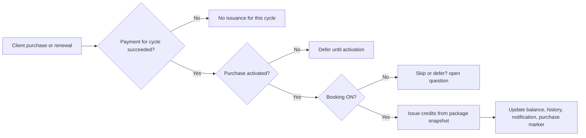

# Feature Summary

P3.1 adds package-based automated session credit issuance into the Payments & Packages lifecycle. Coaches configure session-credit rules on a package, clients purchase through package links or payment requests, and the system issues credits only when a paid cycle succeeds, the purchase is activated, and Booking is enabled.

This feature spans package pricing setup, purchase lifecycle, invoice lifecycle, activation timing, balance updates, provenance links, notifications, feature-flag suppression, and migration of pre-P3.1 records. Failure impact is high because defects here can create wrong balances, duplicate issuance, silent missed issuance, or misleading payment/purchase states.

## Review Snapshot

- `Current Understanding`: The core model is "package snapshot + per-cycle issuance gate + credit provenance link". Most downstream behavior hangs off those three ideas.
- `Primary Risk`: Cycle-level issuance idempotency and failed-cycle recovery logic are the highest-risk areas because they combine async payment events with activation timing.
- `Blocking Clarifications`: Recharge behavior after failed renewal, Booking-OFF skipped cycle handling, idempotency key design, and exact expiration anchor normalization still need tighter agreement.
- `Recommended Canonical Reading`: For now, treat the spec plus BE flow doc as the primary behavioral source, and treat the image flow as a summarizing aid that may be stale where it conflicts.

## Source Map

| Source | Type | Priority | Used For | Confidence Notes |
|---|---|---|---|---|
| `Spec` | Product spec markdown | High | User stories, AC intent, UI/result expectations, notification wording | Broadest scope, but mixes UI detail with core lifecycle rules |
| `BE Flow` | Backend logic/data-flow markdown | High | Canonical lifecycle, issuance gate, snapshot model, open BE questions | Best source for business flow and recovery logic |
| `State Diagram` | Purchase status image | Medium | Status transition summary and action expectations | Useful for state compression, but not fully authoritative |
| `Invoice Diagram` | Invoice status image | Medium | Invoice state and recharge/refund transition summary | Helpful, but not sufficient alone for issuance rules |
| `Sequence Diagram` | Session credit issuance flow image | Medium | Fast visualization of payment-to-issuance path | Conflicts with text sources on failed-cycle recovery |

## Core Business Flow

| Flow | Trigger | Gate(s) | Outcome | Failure Impact |
|---|---|---|---|---|
| Configure package rules | Coach creates or edits package pricing | Valid session type, quantity, expiration, pricing constraints | Package stores pricing/trial/session-credit configuration | Invalid configuration blocks publish or creates broken issuance setups |
| Sell package and capture snapshot | Client purchases via link or payment request | Payment setup and package publish preconditions | Purchase is created with package snapshot for future issuance | Missing or wrong snapshot corrupts all downstream issuance |
| Issue credits for a paid cycle | Payment success or recharge success for a cycle | Paid cycle + activated purchase + Booking ON | Credits issue once for that cycle, balances/history/notifications update | Wrong gate handling causes duplicate, skipped, or late issuance |
| Back-issue after late activation | Guest purchase activates after one or more paid cycles | Activation event + previously paid but unissued cycles | Catch-up issuance runs per eligible paid cycle | Wrong catch-up behavior creates silent credit loss or over-issuance |
| Preserve and suppress across flags and migration | Booking OFF, P&P OFF, pre-P3.1 data | Feature-flag and legacy-record rules | Historical data persists; new issuance may be suppressed | Hidden history, bad linkage, or accidental issuance on legacy records |

## Canonical Business Rules

| Rule ID | Canonical Rule | Primary Source | Confidence | Why It Matters |
|---|---|---|---|---|
| `R1` | A package can hold 1-5 session-credit rules, each tied to a distinct eligible session type | `Spec` + `BE Flow` | Confirmed | This controls configuration validity and multi-rule coverage |
| `R2` | Credits issue only when the cycle is paid, the purchase is activated, and Booking is ON | `BE Flow` + `Spec` | Confirmed | This is the central issuance gate |
| `R3` | Existing purchases keep using their package snapshot even if the package is edited later | `BE Flow` + `Spec` | Confirmed | This protects contract stability for existing buyers |
| `R4` | Free trial delays issuance; no credits issue during the trial period | `Spec` + `BE Flow` | Confirmed | This changes the first issuance trigger and expiration anchor |
| `R5` | Recharge success after failed first-paid or overdue cycle can still trigger issuance for that cycle | `Spec` + `BE Flow` | Conflicted | The text sources agree, but the sequence image suggests permanent skip on failed renewal |
| `R6` | Expiration anchor depends on purchase model and cycle context, not just payment timestamp | `Spec` + `BE Flow` | Confirmed | Wrong anchor silently changes available-credit lifetime |
| `R7` | Booking OFF suppresses issuance and credit-related UI/notifications | `Spec` + `BE Flow` | Open | Suppression is clear, but whether skipped paid cycles are later backfilled is not fully resolved |
| `R8` | Refunded paid invoices do not automatically remove already-issued credits | `BE Flow` | Confirmed | Important for reconciliation and negative-path expectations |

## Gaps & Missing Logic

| Gap Type | Missing Logic | Impact | Follow-up |
|---|---|---|---|
| `Failure / Recovery` | Durable idempotency key for one-cycle-one-issuance is not specified | Duplicate issuance risk under webhook retry or activation replay | Ask BE to define issuance marker and replay rules |
| `Integration / Event` | Ordering and retry behavior across payment success, recharge, and activation events is not fully formalized | Async timing defects can create inconsistent balances | Require event-order and retry notes in BE design |
| `Observability / Audit` | Partial-failure behavior after issuance but before history/notification update is not defined | QA cannot verify atomicity or recovery expectations cleanly | Ask for transaction or compensation model |
| `Permission / Role` | Final notification recipient scope is still soft | Multi-coach workspaces may over-notify or under-notify | Freeze recipient model before detailed TCs |
| `Migration / Compatibility` | Long-term handling rules for mixed legacy and P3.1 purchases are shallow | Legacy records may mis-render or enter wrong issuance paths | Expand migration verification notes |
| `State / Lifecycle` | Simultaneous pricing edits are unresolved at policy level | Concurrency outcome may differ between environments | Product/BE should choose last-write-wins or optimistic fail explicitly |

## Conflicts & Ambiguities

### Conflicts

| Conflict Type | Sources | Conflict | Why It Matters | Provisional Reading |
|---|---|---|---|---|
| `Source Conflict` | `Sequence Diagram` vs `Spec` + `BE Flow` | Sequence image says failed renewal cycle is permanently skipped; text sources say recharge success can still issue that cycle | Drives whether credits are lost forever or recoverable after recharge | Follow the text sources until product/BE explicitly revises them |
| `Calculation / Date Anchor Conflict` | `Spec` vs `BE Flow` | One-time-with-trial expiration anchor is described differently across sources | Can change expiry date and immediate-expire behavior | Normalize in BE doc before TC generation; current safer reading is model-specific anchor, not raw payment date |
| `Terminology Conflict` | `Spec` + images | `Cancelled` vs `Canceled`, `Cancel soon` vs `Cancels Soon`, `Expires soon` vs `Expires Soon` | Affects filters, UI status checks, and traceability | Standardize on one status vocabulary before deep analysis |

### Ambiguities

| Ambiguity Type | Area | What Is Unclear | Why It Matters | Suggested Owner |
|---|---|---|---|---|
| `Product Ambiguity` | Booking OFF skipped cycles | If a paid cycle was skipped because Booking was OFF, is it permanently lost or later backfilled? | Direct balance impact and customer fairness issue | Product / BE |
| `Timing / Async Ambiguity` | Late activation catch-up | Should back-issuance run synchronously on activation or asynchronously via queue? | Changes UX timing, observability, and retry testing | BE |
| `Backend Behavior Ambiguity` | Archived session type display lookup | What happens if live lookup of archived session type metadata partially fails? | Impacts purchase details and Balance History rendering | BE |
| `Data Ownership Ambiguity` | Notification recipients | Which coach set receives issuance notifications in shared-client scenarios? | Affects permission and notification coverage | Product / BE |

## Clarification Items & Recommendations

| Question | Why It Matters | Suggested Owner | Recommendation |
|---|---|---|---|
| Should recharge success for failed renewal issue the missed cycle's credits? | Changes recovery behavior and revenue-to-credit integrity | Product / BE | Align all artifacts to one explicit answer; current working read is `yes` |
| What exactly keys cycle-level idempotency? | Prevents duplicate issuance under retries and replays | BE | Require a durable cycle marker keyed by purchase plus invoice/cycle identity |
| Are Booking-OFF skipped cycles backfilled later? | Changes suppression semantics and downstream support expectations | Product / BE | Keep current working read as `no backfill` until confirmed otherwise |
| Is late-activation catch-up sync or async? | Changes perceived balance timing and failure handling | BE | Async is acceptable if prompt visibility and retry behavior are defined |
| Which source defines the canonical expiration anchor per model? | Avoids silent mismatch in expiry calculations | Product / BE | Consolidate into one normalized rule table before testcase generation |
| Who receives issuance notifications in multi-coach setups? | Needed for role and negative-path coverage | Product / BE | Freeze one recipient policy early |

## High-Level Scenarios

| Scenario Type | US / Area | Scenario | Expectation | Priority |
|---|---|---|---|---|
| Happy path | `US1 + US7` | Coach configures valid recurring rules, publishes package, logged-in client buys, and first paid cycle succeeds | Credits issue once, balances/history update, and source linkage is correct | `P0` |
| Happy path | `US7` | Guest client buys successfully, stays unactivated through paid cycles, then activates later | Catch-up issuance runs for eligible paid cycles with correct cycle-based expiration | `P0` |
| Alternate path | `US1 + US7` | Package includes free trial and client later reaches the first paid invoice | No issuance during trial; first eligible paid cycle issues only after activation gate passes | `P0` |
| Alternate path | `US2 + US7` | Coach edits a published package after earlier clients already purchased it | Future purchases use new rules; existing purchases stay on their original snapshot | `P0` |
| Negative path | `US7` | Renewal invoice fails or becomes overdue, then recharge later succeeds | No immediate issuance on failure; recharge behavior follows the agreed recovery rule without double-issuing | `P0` |
| Negative path | `US1 + US2 + US8` | Session type becomes archived or loses `require_credit` mid-edit or before publish | Save or publish is blocked with recoverable guidance and invalid rule is not persisted | `P1` |
| Regression-sensitive path | `US3 + US4 + US9` | Purchase and invoice states move through active, overdue, paused, cancel-soon, expire-soon, expired, and cancelled paths | Status labels, filters, and available actions remain consistent across surfaces | `P1` |
| Integration path | `US4 + US6 + US7 + US10` | Issuance event is reflected in Balance History, Purchase Details, Client Overview, Sessions/Credits tab, and notifications | All linked surfaces show the same business outcome and respect permission rules | `P1` |
| Migration path | `US13` | Pre-P3.1 packages and purchases are rendered in the new UI | Legacy records remain visible and do not trigger unintended issuance from null snapshots | `P1` |

## Testing Technique Reference

| Technique | Apply To | Why |
|---|---|---|
| Decision Table Testing | Payment success, activation, Booking ON/OFF, trial mode, recurring vs one-time | The issuance engine is driven by a compact but high-risk rules matrix |
| State Transition Testing | Purchase statuses, invoice statuses, pause/cancel/reactivate/recharge paths | Status changes directly control actions and issuance eligibility |
| Boundary Value Analysis | Quantity 1-100, rule count 1-5, billing cycle 1-12, expiration-duration bounds | Several hard numeric limits govern valid configuration |
| Equivalence Partitioning | Activation path, pricing model, trial presence, feature-flag state, session type validity | Collapses repetitive setup while preserving behavior classes |
| Error Guessing | Webhook replay, activation replay, stale tabs, mixed legacy records, concurrent saves | Real production defects are likely to emerge in timing and stale-state edges |
| Risk-based Regression | Package publish/edit, purchase details, balance history, notifications, client profile | P3.1 touches broad existing payment and booking surfaces |

## Risk Assessment

| Risk Area | Description | Likelihood | Impact | Priority | Suggested Focus |
|---|---|---|---|---|---|
| Cycle-level issuance idempotency | Same paid cycle may issue twice if webhook retries and activation replay are not guarded | High | High | P0 | Verify one-cycle-one-issuance under retries and reordered events |
| Failed-cycle recovery logic | Conflicting source rules can cause skipped credits or unintended retroactive issuance | High | High | P0 | Validate failed, overdue, recharge, and recovery variants for each pricing model |
| Snapshot vs live-rule boundary | Existing purchases may incorrectly pick up edited package rules or lose archived session types | Medium | High | P0 | Verify snapshot immutability and intentional live lookups only |
| Expiration anchor calculation | Wrong anchor can overgrant or instantly expire credits incorrectly | Medium | High | P0 | Validate one-time, trial, recurring, and late-activation anchors |
| Feature-flag suppression | Booking OFF or P&P OFF may hide UI but still issue credits or fire notifications | Medium | High | P0 | Validate suppression at issuance, history linkage, and notification layers |
| Migration of legacy records | Old purchases with null snapshots may mis-render or enter unintended issuance paths | Medium | Medium | P1 | Validate migrated packages/purchases and safe legacy handling |

## Edge Cases & Race Conditions

### Edge Cases

| US / Area | Edge Case | Expectation | Priority |
|---|---|---|---|
| `US7` | Guest purchase never activates | Payment may succeed, but no credits issue until activation happens | `P0` |
| `US7` | Late activation happens after multiple paid cycles and some calculated expirations are already in the past | Each eligible cycle issues, and already-expired credits are issued then immediately expired | `P0` |
| `US7` | Client is archived while purchase remains active and paid | Issuance still continues for successful eligible cycles | `P1` |
| `US7` | Paid invoice is later refunded after credits were already issued | Credits remain unless manually removed through older flows | `P1` |
| `US13` | Pre-P3.1 purchase has null snapshot but is shown in new UI | Legacy purchase renders safely without inventing issuance history | `P1` |
| `US2 + US7 + US8` | Session type is removed from the live package after a purchase already captured it in snapshot | Existing purchase still issues according to its frozen snapshot | `P1` |

### Race Conditions / Timing Risks

| US / Area | Race / Timing Risk | Expectation | Priority |
|---|---|---|---|
| `US7` | Payment success arrives before activation on guest path, then activation occurs much later | No early issuance before activation; catch-up issuance runs correctly after activation | `P0` |
| `US7` | Webhook retries or duplicate activation events replay the same issuance opportunity | Same cycle must not issue twice | `P0` |
| `US2 + US7` | Coach edits package rules between two close-together purchases | Each purchase keeps the correct snapshot version captured at its own purchase time | `P0` |
| `US1 + US8` | Session type becomes archived or loses `require_credit` while another tab still has it selected | Save is rejected and invalid rule does not slip through due to stale UI state | `P1` |
| `US3 + US4 + US7` | Renewal payment succeeds near pause, cancel-soon, or reactivate boundary | Issuance follows the correct status gate for that exact cycle boundary | `P1` |
| `US7 + US12` | Booking feature flag toggles near the issuance moment | Skip-vs-defer behavior follows the agreed rule and is consistent across retries | `P1` |
| `US7 + US11` | Credit issuance succeeds but history or notification append fails afterward | System should not leave balances and audit trail permanently inconsistent | `P0` |

## Suggested Next Inputs For qa-master-workflow

- Use `Feature Summary`, `Source Map`, `Core Business Flow`, and `Canonical Business Rules` as upstream input for `@qa-context-builder`.
- Use `Risk Assessment`, `High-Level Scenarios`, and the clarified canonical readings as upstream input for `@qa-strategy-decomposer`.
- Resolve the failed-cycle recovery rule, Booking-OFF skipped-cycle behavior, and idempotency design before deep analysis or detailed TCs.
