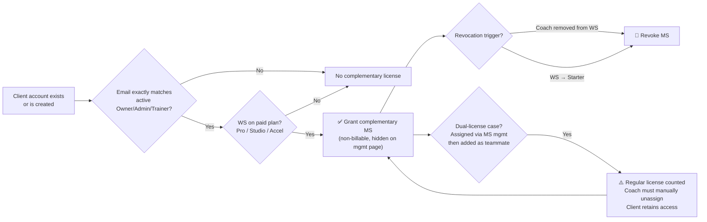

# Feature Summary

**Feature:** MacroSnap — Free Access for Coach's Own Client Account
**Primary Actor:** System (auto-grant engine), Coach (UI awareness), Client (MS beneficiary)
**Business Goal:** Eliminate the need for coaches to purchase a paid MS license for their own personal/test client account (same email as coach). CEO-escalated issue — directly impacts coach trust and NPS.
**Impacted Surfaces:** MS license engine, client profile UI (disabled assign/unassign button + tooltip), MS management page, MS subscription seat count, email notification system (excluding WL WS), migration/backfill job, WS plan change handler, coach state change handler
**Consequence if Feature Fails:** Coaches incorrectly charged for their own accounts; free access leaks to ineligible accounts; seat count corruption; MS management page data inconsistency; disabled UI button not showing or functioning incorrectly; coach trust damage.

> **Post-meeting spec revision note:** Archive/unarchive is no longer a revocation/re-grant trigger (removed from product scope — MS UI not hidden for archived clients). UI assign/unassign button on client profile is now disabled with tooltip instead of toggleable. Email NOT sent for White Label WS. Dual-license reconciliation path added (client assigned via MS management first, then added as teammate).

---

## Review Snapshot

- **Current Understanding:** System auto-grants a complementary (non-billable) MS license to any connected client whose email exactly matches an active Owner, Admin, or Trainer on the same paid Self-Serve WS (Pro, Studio, Accelerator Bundle). License is invisible on MS management page and does not consume subscription seats. Revocation triggered by: coach removed from WS or WS downgraded to Starter (archive is **no longer** a revocation trigger; Admin→Trainer demotion is also **not** a revocation trigger). Client profile UI shows a disabled assign button with tooltip when WS has an MS subscription. Email NOT sent for White Label WS. One-time retroactive email sent for existing eligible accounts on non-WL WS only.
- **Primary Risk:** Pre-release migration data integrity. Two critical scenarios need protection: (1) coaches who manually assigned a regular MS license to their own client before release — post-migration seat count and reconciliation remain undefined; (2) coaches who manually un-assigned MS before release — SME says keep unassigned and do not auto-grant during migration. Dual-license clients assigned via MS management first then added as teammate remain a P0 billing path.
- **Blocking Clarifications:** (1) Pre-release manual assign migration behavior — needs BE spec + prod data scan; (2) Email case-sensitivity of "exact match"; (3) All client activation paths (invite, add teammate, claim package) confirmed to fire grant check; (4) WS upgrade from Starter→paid: retroactive re-grant behavior undefined; (5) Tooltip copy: should tooltip on disabled button show for ALL coaches or only those on WS with purchased MS subscription?
- **Recommended Canonical Reading:** Complementary license is a system-managed shadow license — independent of manually-assigned regular licenses. The client profile UI disabled button is cosmetic only (acknowledges the complementary status); it does not affect the underlying complementary license state. For the dual-license edge case (MS management → teammate), the regular license takes precedence in billing until manually unassigned, at which point the complementary license continues to provide access non-billably. Both readings are `[inferred]` — spec defines behavior partially but does not fully specify precedence logic.

---

## Source Map

| Source | Type | Priority | Used For | Confidence Notes |
|---|---|---|---|---|
| spec.md v2 (post-meeting, uploaded) | Product Spec | P1 | Updated ACs, revised business rules, new US2 AC3, WL email exclusion, dual-license edge case | Primary source; supersedes original spec.md |
| spec.md v1 (original project file) | Product Spec | P2 | Baseline reference; archive/unarchive AC, original AC6 | Superseded — used for delta comparison only |
| User concern notes (Khai) | SME Input | P1 | Pre-release data risks, state transition edge cases, activation paths, migration matrix, QA-internal archive state concern | High domain context; partially addressed by v2 spec |
| Jira PAY-2556 | Ticket | P2 | US1 reference | URL noted; not fetched |
| Jira PAY-2557 | Ticket | P2 | US2 reference | URL noted; not fetched |

---

## Change Log (v1 → v2)

| Change | v1 Behavior | v2 Behavior | QA Impact |
|---|---|---|---|
| Archive as revocation trigger | Archived client → MS revoked; unarchive → re-grant | **Removed.** Archive/unarchive has no impact on complementary license | Remove F3/F4 flows from product test scope; retain as QA-internal state transition verification |
| Client profile UI | Coach can assign/unassign MS toggle freely | **Disabled button** with tooltip; always shows "Assigned"; hidden when MS subscription is cancelled | New UI test surface: disabled state, tooltip content, visibility when MS cancelled |
| Dual-license (MS mgmt → teammate) | Not specified | Client assigned via MS management first, then added as teammate with same email → license IS counted. Coach must manually unassign; client retains access non-billably | New P0 edge case for migration and ongoing state |
| WL email notification | WL WS: "Yes" (implied email sent) | **Email NOT sent for WL WS** | Update email test scope; add WL-specific email suppression test |
| Re-grant trigger | Unarchive | Removed (no archive trigger) | Simplifies revocation/re-grant matrix |

---

## Core Business Flow

| Flow | Trigger | Gate(s) | Outcome | Failure Impact |
|---|---|---|---|---|
| F1: New client auto-grant | Coach creates new client account (invite path) | Email matches active Owner/Admin/Trainer + WS is paid plan | Complementary MS granted immediately at creation | Client on paid WS doesn't get free MS |
| F2: Retroactive migration grant | System deployment | Existing connected client email matches active Owner/Admin/Trainer + WS is paid plan + not explicitly pre-release manual-unassigned; WL grant scope still OQ-03 | Complementary MS granted when eligible; one-time email sent for non-WL only | Existing eligible accounts missed; email sent to WL WS incorrectly; manually unassigned state overwritten |
| F3: Revoke on coach removal | Coach removed/deleted from WS | Client had complementary MS via that coach email | MS revoked immediately | License persists after coach removed |
| F4: Revoke on WS downgrade | WS plan changed to Starter | Complementary MS was active | All complementary licenses on WS revoked | Licenses persist on downgraded WS |
| F5: Add teammate — dual-license reconciliation | Client already has regular MS via MS management; coach adds teammate with same email | Email matches active Owner/Admin/Trainer + WS paid | Regular license still counted to subscription; coach must manually unassign; client retains access as complementary | Coach unaware seat is being consumed; billing anomaly |
| F6: UI disabled state — client profile | Coach views client profile on WS with active MS subscription | Client has complementary license | Assign/Unassign button disabled; tooltip shown; always shows "Assigned" status | Button stays enabled (regression from old behavior); tooltip missing |
| F7: UI hidden state — MS cancelled | WS MS subscription cancelled | Coach views client profile of complementary client | Assign/Unassign button hidden entirely | Button remains visible after MS cancellation |

> **Note:** Archive/unarchive of client is NOT a revocation/re-grant trigger (removed from product scope in v2). QA must still verify archived client state does not accidentally trigger grant/revoke logic.

---

## Canonical Business Rules

| Rule ID | Canonical Rule | Primary Source | Confidence | Why It Matters |
|---|---|---|---|---|
| BR-01 | Client email must exactly match an active Owner, Admin, or Trainer email on the same WS | SME correction over Spec v2 wording | Confirmed | Primary eligibility gate — determines who qualifies |
| BR-02 | Eligible WS plans: Pro, Studio, Accelerator Bundle only | Spec v2 | Confirmed | Free Trial and Starter excluded; plan check is a hard gate |
| BR-03 | Complementary license is not counted toward MS subscription seat count | Spec v2 | Confirmed | Core billing integrity — must verify count before/after migration |
| BR-04 | Complementary license is not displayed in MS management page | Spec v2 | Confirmed | Management page must stay clean; regression risk |
| BR-05 | Complementary license is not displayed in license assignment dropdown | Spec v2 | Confirmed | Prevents manual re-assignment of the complementary slot |
| BR-06 | Revocation triggers: coach removed from WS **OR** WS downgraded to Starter. Archive is **NOT** a trigger. | Spec v2 (AC3) | Confirmed | Reduced from v1; archive removed — must not test archive as revocation |
| BR-07 | ~~Re-grant on unarchive~~ **REMOVED** | Spec v1 → removed in v2 | Removed | No longer applicable; archive has no license impact |
| BR-08 | Retroactive grant on deployment for existing matching accounts; one-time email sent | Spec v2 (AC4) | Confirmed | Migration job correctness critical |
| BR-09 | No email for new accounts created post-deployment | Spec v2 (AC4) | Confirmed | Email gate must be conditional on deployment timestamp |
| BR-10 | **Email NOT sent for White Label WS** | Spec v2 (meeting decision) | Confirmed | WL WS excluded from email notification path; test suppression |
| BR-11 | Client profile UI: when WS has active MS subscription, assign/unassign button is **disabled**; always shows "Assigned"; hover shows tooltip | Spec v2 (US2 AC3) | Confirmed | New UI behavior replacing old toggleable button |
| BR-12 | Client profile UI: button is **hidden** when MS subscription is cancelled | Spec v2 (US2 AC3) | Confirmed | Hidden ≠ disabled — different states; both must be tested |
| BR-13 | Dual-license case: client assigned via MS management first, then added as teammate with same email → that license IS counted to subscription. Coach must unassign; client retains complementary access. | Spec v2 (US2 AC3 edge case) | Confirmed | Critical billing edge case; migration prod data may have this state |
| BR-14 | Owner, Admin, and Trainer roles qualify when email and WS plan gates pass | SME correction | Confirmed | Prevents false-negative coverage for Trainer coaches |
| BR-15 | WS upgrade from Starter → paid: retroactive re-grant behavior | Not in spec v2 | Open | Symmetric behavior to F4 not defined |
| BR-16 | Pre-release manual assign remains open; pre-release manual unassign must stay unassigned | SME correction + missing BE detail | Mixed: assign Open, unassign Confirmed | Critical migration risk |

---

## Gaps & Missing Logic

| Gap Type | Missing Logic | Impact | Follow-up |
|---|---|---|---|
| Migration / Compatibility | No spec for coaches who manually **assigned** a regular MS license to their own client BEFORE release. Post-release: seat count? MS page record? How does migration reconcile with the new complementary grant? | Critical | Scan prod data; define migration reconciliation logic; add to migration spec |
| Migration / Compatibility | Pre-release manual **un-assigned** MS from own client must remain unassigned after release; migration must not auto-grant complementary for this state. | Critical | Convert to migration regression assertion; confirm BE query excludes this state |
| Migration / Compatibility | Dual-license edge case (BR-13) in prod data: clients assigned via MS management who were later added as teammates — how many exist? Are they flagged for manual unassign? | Critical | Scan prod data; communicate to coaches; plan migration cleanup path |
| Migration / Compatibility | Migration data matrix (Concern #5): coach without MS plan, coach with MS plan, connected/archived/pending client who is Owner/Trainer/Admin of WS, plus pre-release manual assign/unassign states — distinct expected post-migration states | Critical | Build dedicated migration test matrix; request BE walk-through before QA starts |
| State / Lifecycle | `pending → connected` client state: no AC for this transition as a grant trigger | High | Confirm with BE whether pending→connected fires grant check |
| State / Lifecycle | `connected → delete` (hard delete) client: does system handle license cleanup before delete? | Medium | Confirm with BE; test data integrity on delete path |
| State / Lifecycle | `pending → active` coach state: coach pending, client already connected with matching email — grant trigger when coach becomes active? | High | Add explicit AC; verify with BE |
| State / Lifecycle | `active → delete` coach: is this equivalent to "removed from WS" revocation trigger? | Medium | Confirm with BE whether hard delete fires same revocation path |
| State / Lifecycle | **QA-internal (not product scope):** Archive/unarchive removed from product AC, but QA must still verify archived client state does NOT accidentally trigger grant/revoke. Also: email migration query must correctly exclude or include archived clients based on BE logic. | High (QA risk) | Add archived client state transition as QA-internal verification; confirm migration query filters |
| State / Lifecycle | WS plan **upgrade** from Starter → paid: retroactive re-grant behavior not in spec | High | PM/BE clarification needed; `[inferred]` re-grant expected |
| Business Rule | Email comparison case-sensitivity: "exactly matches" — case-sensitive or not? | Medium | Clarify with BE; recommend normalizing to lowercase |
| Business Rule | Coach role demotion (Owner/Admin → Trainer, not deleted): SME confirms no revocation impact. | Medium | Add regression assertion: role demotion to Trainer preserves complementary access |
| Business Rule | Tooltip copy on disabled button (US2 AC3): spec shows callout copy matching US2 AC1. Should tooltip show for coaches WITHOUT a purchased MS subscription on a paid WS? | Low-Medium | Clarify spec scope for tooltip visibility |
| Integration / Event | Client activation via **"claim package"** path: does this trigger grant eligibility check? | Medium | Verify with BE; confirm whether in scope |
| Integration / Event | **"Add teammate"** path is now partially covered by BR-13 (dual-license case). But does adding a teammate where client does NOT have a prior MS assignment also trigger the complementary grant check? | High | Confirm both sub-cases with BE |
| Failure / Recovery | Retroactive grant email failure: retry behavior? Audit log? | Low-Medium | Confirm with BE |
| Observability / Audit | No audit log for complementary license grant/revoke events | Medium | Raise as non-functional requirement |
| Permission / Role | **WL email confirmed excluded (BR-10).** But WL WS plan eligibility for the complementary license itself — does WL WS still qualify for the grant, just without email? | Low-Medium | Confirm WL grant eligibility vs. WL email exclusion are independent rules |

---

## Conflicts & Ambiguities

### Conflicts

| Conflict Type | Sources | Conflict | Why It Matters | Provisional Reading |
|---|---|---|---|---|
| Terminology Conflict | Spec v2 Permissions vs. AC1 vs. SME correction | Permissions says "active Owner or Admin"; AC1 says "active coach of WS"; SME confirms Trainer is same as Owner/Admin for this feature | Determines if Trainers qualify | Confirmed: Owner/Admin/Trainer qualify; treat spec wording as stale/narrow |
| Lifecycle Conflict | Spec v2 AC3 vs. missing AC | AC3 covers coach removal + WS downgrade as revocation. No AC covers WS upgrade back to paid → re-grant | Missing symmetric behavior | Provisional: WS upgrade should trigger retroactive re-grant. Needs PM confirmation. `[inferred]` |
| Scope Conflict (resolved v2) | Spec v1 AC6 vs. Spec v2 US2 AC3 | v1 allowed toggle assign/unassign; v2 replaced with disabled button + tooltip | **Resolved in v2.** Button is now always disabled with tooltip for complementary clients. | Confirmed: disabled + tooltip is correct behavior. Old AC6 is deprecated. |
| Lifecycle Conflict (new) | Spec v2 BR-13 vs. BR-03 | BR-13: client assigned via MS management then added as teammate → license IS counted. BR-03: complementary license NOT counted. Two licenses, two rules — which wins? | Critical for billing correctness in dual-license state | Provisional: Regular license (from MS management) is counted until manually unassigned. After unassign, complementary takes over non-billably. `[inferred]` — needs BE confirmation on transition moment |

### Ambiguities

| Ambiguity Type | Area | What Is Unclear | Why It Matters | Suggested Owner |
|---|---|---|---|---|
| Backend Behavior Ambiguity | Email match | Case-sensitivity of email comparison | Missed grants on case mismatch | BE |
| Backend Behavior Ambiguity | Dual-license precedence | At the exact moment coach unassigns regular license from a dual-license client: does MS access drop and then re-grant, or is it continuous? | Client-side experience continuity | BE |
| Timing / Async Ambiguity | Migration deployment window | Clients created during the migration job window: retroactive email or no email? | Email correctness edge case | BE/PM |
| Timing / Async Ambiguity | Concurrent plan change + migration | Race condition if migration runs while WS plan changes | Data integrity | BE |
| UX Ambiguity | Disabled button tooltip display condition | Does tooltip on disabled button appear for ALL coaches on paid WS, or only those whose WS has an active MS subscription? | UI test scope | PM |
| UX Ambiguity | Button visibility when MS is cancelled mid-session | If coach is viewing client profile and MS subscription is cancelled in real time: does button hide immediately or on next page load? | UI state staleness | BE/FE |
| Product Ambiguity | WL WS grant eligibility | Spec v2 says email not sent for WL WS but still says "WL applicability: Yes" — does WL WS still get the complementary grant, just without the email? | WL test coverage scope | PM |
| Data Ownership Ambiguity | Pre-release license state cleanup | Is reconciliation of pre-release manual license states handled by migration job or separate step? | Migration completeness | BE |

---

## Clarification Items & Recommendations

| Question | Why It Matters | Suggested Owner | Recommendation |
|---|---|---|---|
| What happens to coaches who manually assigned a regular MS license to their own client BEFORE release? Seat count impact post-migration? | Billing integrity; migration correctness | BE/PM | Scan prod data; define reconciliation in migration spec `[inferred: regular license reconciled → complementary takes over]` |
| What happens to coaches who manually UN-assigned MS from own client BEFORE release? | Migration correctness | SME/BE | Resolved by SME: keep unassigned; BE should confirm migration excludes these accounts |
| How many prod accounts match the dual-license case (BR-13: assigned via MS management, then added as teammate)? | Migration data scope | BE | Prod data scan before migration; may require coach notification or automated cleanup |
| Does `pending → active` coach state transition trigger grant for already-connected matching clients? | Grant trigger completeness | BE | Add explicit AC `[inferred: yes]` |
| Does adding a teammate (no prior MS assignment) trigger the same grant eligibility check as invite path? | Activation path coverage | BE | Confirm add-teammate path fires grant check for non-dual-license scenario |
| Does "claim package" path trigger grant eligibility check? | Activation path coverage | BE/PM | Confirm scope |
| Is email match case-sensitive? | Eligibility reliability | BE | Recommend case-insensitive (lowercase normalization) |
| Does WS upgrade from Starter → paid trigger retroactive re-grant? | Symmetric lifecycle | PM | Add AC `[inferred: yes]` |
| Does coach role demotion (Admin→Trainer, not deleted) trigger revocation? | Eligibility correctness | SME/BE | Resolved by SME: no impact; Trainer remains eligible |
| Does WL WS receive the complementary grant (just without email), or is WL excluded from the grant entirely? | WL test scope | PM | Clarify to determine if WL grant tests are needed |
| What are expected post-migration states for all migration data scenarios? | Migration test completeness | BE | Request BE walk-through + migration spec before QA starts |
| Does the disabled button tooltip (US2 AC3) display for coaches on paid WS without an MS subscription, or only when MS subscription is active? | UI test scope | PM | Clarify to scope US2 AC3 test cases |

---

## High-Level Scenarios

| Scenario Type | US / Area | Scenario | Expectation | Priority |
|---|---|---|---|---|
| Happy Path | US1 AC1 | Coach on Pro WS creates new client account using coach email | Complementary MS granted immediately; client accesses MS app without paid license | P0 |
| Happy Path | US1 AC4 | Migration: existing connected client email matches active Owner on paid non-WL WS | Complementary MS granted; one-time email sent | P0 |
| Happy Path | US1 AC4 | Migration: existing connected client email matches active Owner on **WL WS** | Complementary MS granted; **no email sent** | P0 |
| Happy Path | US1 AC3 | Coach removed from WS; client had complementary MS | Complementary MS revoked immediately | P0 |
| Happy Path | US1 AC3 | WS downgraded from Pro to Starter | All complementary MS licenses revoked immediately | P0 |
| Negative | US1 AC2 | Coach views MS management page after complementary grant | Complementary license NOT visible, NOT counted in seat total | P0 |
| Negative | US1 AC2 | Coach views license assignment dropdown | Complementary license NOT listed | P0 |
| UI | US2 AC3 | Coach on paid WS with active MS subscription views client profile of complementary client | Assign/Unassign button disabled; always shows "Assigned"; tooltip visible on hover | P0 |
| UI | US2 AC3 | Coach on paid WS, MS subscription cancelled; views client profile of complementary client | Assign/Unassign button **hidden entirely** | P0 |
| Edge Case | US2 AC3 | Client assigned via MS management first, then added as teammate with same email | Regular license counted to subscription; coach sees enabled unassign option; after unassign — client retains MS access as complementary, seat freed | P0 |
| Edge Case | US1 Pre-release (Concern #1) | Coach had manually assigned regular MS to own client BEFORE release | Post-migration: seat count correct; no double-license; management page clean | P0 |
| Edge Case | US1 Pre-release (Concern #2) | Coach had manually UN-assigned MS from own client BEFORE release | Post-migration: remains unassigned; migration must not auto-grant complementary | P0 |
| Edge Case | US1 State (Concern #4) | Coach was pending; client already connected with same email; coach becomes active | Complementary MS grant fires when coach becomes active | P0 |
| Edge Case | US1 Migration (Concern #5) | Connected client is Admin in WS (same email) | Complementary MS granted | P0 |
| Edge Case | US1 Migration (Concern #5) | Connected client is Trainer in WS | Complementary MS granted same as Owner/Admin when other gates pass | P0 |
| QA-Internal | US1 Archived state | Coach archives client who has complementary MS | MS access NOT revoked (archive removed from product scope) — verify no accidental revoke | P1 |
| QA-Internal | US1 Archived state | Coach unarchives client who previously had complementary MS | MS access should already be active (no re-grant event needed) — verify state consistency | P1 |
| QA-Internal | Migration email targeting | Migration job runs; verify archived clients with matching email are handled correctly | Archived clients: correct email targeting per BE migration query spec | P1 |
| Edge Case | US1 WS Plan | WS upgrades from Starter to Pro with existing eligible connected clients | Complementary MS re-granted retroactively `[inferred]` | P1 |
| UI | US2 AC1 | Coach on paid WS (no MS subscription) views MS page | Perk awareness callout below "PURCHASE LICENSES" CTA | P1 |
| UI | US2 AC2 | Coach on Free Trial views MS page | Upsell callout + "Upgrade Everfit plan" link; click → plan selection page | P1 |

---

## Testing Technique Reference

| Technique | Apply To | Why |
|---|---|---|
| State Transition Testing | Client state (connected/archived/pending/deleted), Coach state (pending/active/deleted), WS plan state (paid/Starter), MS subscription state (active/cancelled) | Feature driven entirely by state combinations — exhaustive transition matrix needed including QA-internal archive verification |
| Decision Table Testing | Grant eligibility: WS plan × coach role × client state × email match × WL flag | 5 conditions create combinatorial eligibility logic |
| Equivalence Partitioning | WS plans (paid / non-paid), coach roles (Owner/Admin/Trainer), WS type (standard / WL), pre-release license state (assigned/unassigned/none) | Group valid/invalid partitions to reduce redundant cases |
| Boundary Value Analysis | Email case boundaries, WS plan change timing, MS subscription cancellation timing | Catch subtle boundary failures |
| Error Guessing | Pre-release data states, dual-license reconciliation, concurrent plan change + migration, archived client state interaction | User-identified high-risk areas with limited spec coverage |
| Risk-based Regression | Billing seat count, MS management page visibility, assignment dropdown, email suppression for WL | High-impact areas where failure causes billing anomaly or trust damage |
| Pairwise Testing | Migration data matrix (coach plan × client role × client status) | Systematic coverage of migration scenarios |

---

## Risk Assessment

| Risk Area | Description | Likelihood | Impact | Priority | Suggested Focus |
|---|---|---|---|---|---|
| Migration data integrity (pre-release manual assign) | Coaches who assigned regular MS to own client pre-release → double-license or corrupt seat count post-migration | High | Critical | P0 | Scan prod data; define reconciliation; test |
| Migration data integrity (dual-license BR-13) | Prod data may have clients assigned via MS management then added as teammates — counted to subscription, needs manual unassign | High | Critical | P0 | Scan prod data; quantify scope; plan coach communication |
| Migration data matrix (Concern #5) | 11 permutations (coach plan × client role × client status) with distinct expected outcomes | High | Critical | P0 | Build dedicated migration matrix; walk through with BE |
| Seat count corruption | Complementary license leaks into subscription count or dual-license state not reconciled correctly | Medium | Critical | P0 | Verify seat count before/after migration; test concurrent operations |
| State transition gaps | Grant/revoke not confirmed for: coach pending→active, coach deleted, client pending→connected, client hard delete | High | High | P0 | Add explicit test cases for all unconfirmed transitions |
| QA-internal archive risk | Archive removed from product scope, but QA must ensure archived client does NOT accidentally trigger grant/revoke. Also: migration email query must handle archived clients correctly. | Medium | High | P0 | Add QA-internal verification pass on archived client states |
| WL email suppression | Email sent to WL WS coaches despite BR-10 exclusion | Medium | High | P1 | Add WL-specific email suppression test to migration scope |
| UI disabled button regression | Assign/Unassign button remains enabled or tooltip missing for complementary clients | Medium | Medium | P1 | Add UI verification for disabled state, tooltip, and hidden-when-cancelled |
| Activation path gaps | "Add teammate" (non-dual-license case) or "claim package" path doesn't fire grant check | Medium | High | P1 | Verify all activation paths trigger eligibility check |
| WS upgrade re-grant | Upgrade from Starter to paid doesn't retroactively restore complementary licenses | Medium | High | P1 | Confirm with PM/BE; add test for upgrade direction |
| Role demotion regression | Owner/Admin demoted to Trainer without deletion — access should remain because Trainer is eligible | Medium | High | P1 | Verify no revoke on Admin→Trainer demotion |
| Email deduplication | Migration job retried → one-time email sent multiple times | Low | Medium | P1 | Test migration retry scenario |
| WL grant eligibility ambiguity | WL WS may or may not receive complementary grant (spec unclear on grant vs email separation) | Low | Medium | P2 | Confirm with PM; test on WL instance |

---

## Edge Cases & Race Conditions

### Edge Cases

| US / Area | Edge Case | Expectation | Priority |
|---|---|---|---|
| US1 Pre-release (Concern #1) | Coach manually assigned regular MS to own client BEFORE release | Post-release: complementary license applied; regular license reconciled; no seat count double-count | P0 |
| US1 Pre-release (Concern #2) | Coach manually UN-assigned MS from own client BEFORE release; coach on paid WS | Post-release: remains unassigned; migration must not auto-grant complementary MS | P0 |
| US2 AC3 (BR-13) | Client assigned via MS management first → added as teammate with same email | Regular license counted to subscription; coach unassigns → client retains access as complementary; seat freed | P0 |
| US1 Migration (Concern #5) | Coach has NOT purchased MS plan; connected client with matching email | Complementary MS granted regardless — not tied to MS subscription purchase | P0 |
| US1 Migration (Concern #5) | Coach HAS purchased MS plan; client already assigned a paid license pre-release | Migration: reconcile; seat count must not change incorrectly | P0 |
| US1 Migration (Concern #5) | Connected client is Owner of the WS | Email match with Owner confirmed; complementary MS granted | P0 |
| US1 Migration (Concern #5) | Connected client is Admin in WS | Admin qualifies; complementary MS granted | P0 |
| US1 Migration (Concern #5) | Connected client is Trainer in WS | Trainer eligible; complementary MS granted when other gates pass | P0 |
| US1 Migration — WL | Connected client on WL WS qualifies by email match | Complementary MS granted; **no email sent** | P0 |
| US1 State (Concern #4) | Client: pending → connected | Grant check fires on transition to connected | P0 |
| US1 State (Concern #4) | Client: connected → delete (hard delete) | MS revoke fires; no orphaned license | P1 |
| US1 State (Concern #4) | Coach: pending → active; client already connected with same email | MS grant fires when coach becomes active | P0 |
| US1 State (Concern #4) | Coach: active → delete | MS revoked; equivalent to removal trigger | P0 |
| **QA-Internal** | Client: connected → archived (coach still active, WS paid) | MS access **NOT revoked** (archive no longer a trigger) — verify no unintended revoke | P1 |
| **QA-Internal** | Client: archived → connected (unarchive) | MS access should remain active (was never revoked by archive) — verify state consistency | P1 |
| **QA-Internal** | Migration: archived client with matching email | Confirm migration query handles archived clients correctly per BE spec — verify whether included or excluded from grant | P1 |
| US1 Migration (Concern #5) | Archived client is Owner/Admin/Trainer of WS | Confirm migration behavior: is archived client eligible for grant? (No product AC; QA must verify BE decision) | P1 |
| US1 Migration (Concern #5) | Pending client is Owner/Admin/Trainer of WS | Confirm migration behavior for pending client state | P1 |
| US1 Plan | WS upgrades from Starter → Pro with existing eligible connected clients | Complementary MS re-granted retroactively `[inferred]` | P1 |
| US2 AC3 UI | Coach on paid WS with MS subscription: views client profile of complementary client | Button disabled; tooltip on hover; always shows "Assigned" | P0 |
| US2 AC3 UI | MS subscription cancelled; coach views client profile | Button **hidden entirely** (not just disabled) | P0 |
| US2 AC1 | Paid WS coach (no MS subscription purchased) views MS page | Perk awareness callout shown below CTA | P1 |
| US2 AC2 | Free/Trial coach clicks "Upgrade Everfit plan" | Navigates to Choose my plan page | P1 |

### Race Conditions / Timing Risks

| US / Area | Race / Timing Risk | Expectation | Priority |
|---|---|---|---|
| US1 Migration | Migration job runs while WS plan changes (Starter↔paid) concurrently | Migration captures correct plan state; no partial grants | P0 |
| US1 Migration | Migration job retried; email re-triggered for already-granted accounts | Email deduplication: one email per account max | P1 |
| US1 Grant/Revoke | Coach creates new client + WS plan changes to Starter simultaneously | Revocation fires after grant; client ends without MS | P1 |
| US1 Grant/Revoke | Coach removed from WS + new client with same email being created simultaneously | Grant check uses post-removal state; no grant | P1 |
| US2 AC3 UI | MS subscription cancelled while coach is on client profile page | Button hides on next render or immediately — no stale UI state | P1 |
| BR-13 Dual-license | Coach manually assigns regular MS AND system grants complementary to same client simultaneously | Seat count reflects only regular license; no double-count | P1 |

---

## Suggested Next Inputs For qa-master-workflow

**Context Builder can use:**
- This `high-level-strategy-analysis.md` (v2, finalized) as primary upstream input
- `spec.md v2` (uploaded post-meeting) as AC-level source
- User concern notes (embedded in this analysis under Concerns #1–#5) as supplementary context

**Strategy Decomposer should plan modules around:**
1. Complementary License Grant Engine (auto-grant, all activation paths: invite, add teammate, claim package)
2. Revocation Logic (coach removal, WS downgrade — archive is NOT a trigger)
3. Dual-license Reconciliation (MS management → teammate edge case, BR-13)
4. Seat Count & MS Management Page Integrity
5. State Transition Matrix (client × coach × WS plan × MS subscription state)
6. Pre-release Migration / Backfill Job (including Concern #5 matrix)
7. Email Notification Logic (retroactive vs. new; WL suppression; deduplication)
8. UI Disabled Button & Tooltip (client profile, MS cancelled hidden state)
9. QA-Internal Archive State Verification (not product scope, but must not regress)

**Must resolve before deeper TC work begins:**
- [ ] Pre-release manual assign state: migration behavior needs BE spec + prod data scan
- [x] Pre-release manual unassign state: SME says keep unassigned; migration must not auto-grant
- [ ] Dual-license (BR-13) scope: how many prod accounts match this pattern?
- [ ] Confirm all activation paths (invite, add teammate, claim package) fire grant check (Concern #3)
- [ ] Confirm state transitions: coach pending→active, client pending→connected, coach hard delete (Concern #4)
- [ ] Confirm expected post-migration states for all migration data scenarios (Concern #5)
- [ ] Confirm whether archived clients are included/excluded in migration grant query (QA-internal)
- [ ] Email case-sensitivity confirmation
- [ ] WS upgrade direction re-grant confirmation
- [x] Coach role demotion (Admin→Trainer): no revocation impact; Trainer remains eligible
- [ ] WL WS: grant eligible but email suppressed, OR grant also excluded?
- [ ] Tooltip display condition: all paid WS or only WS with active MS subscription?
